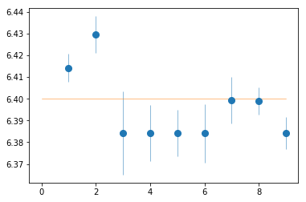
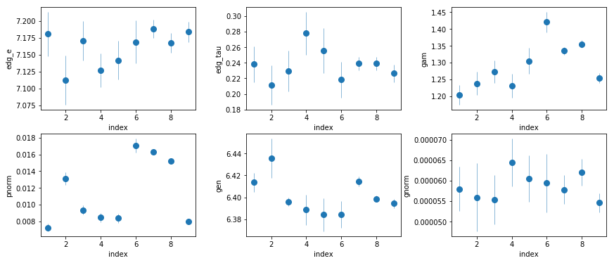
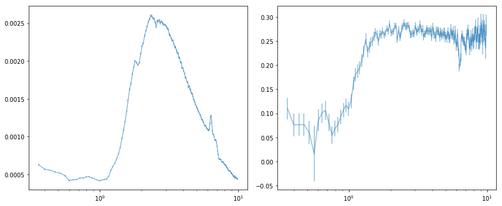
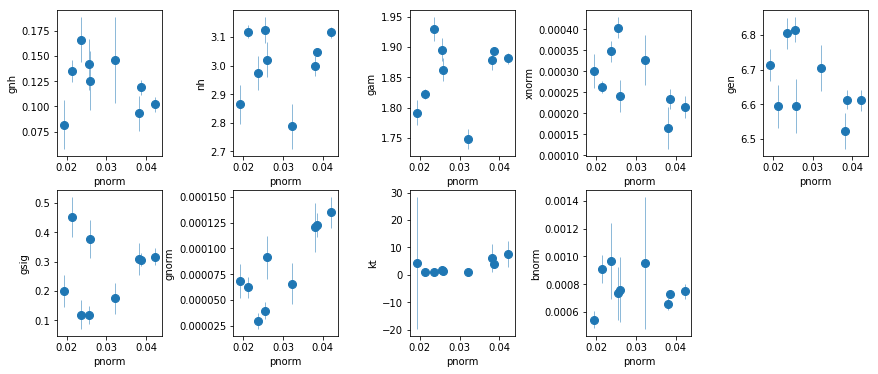
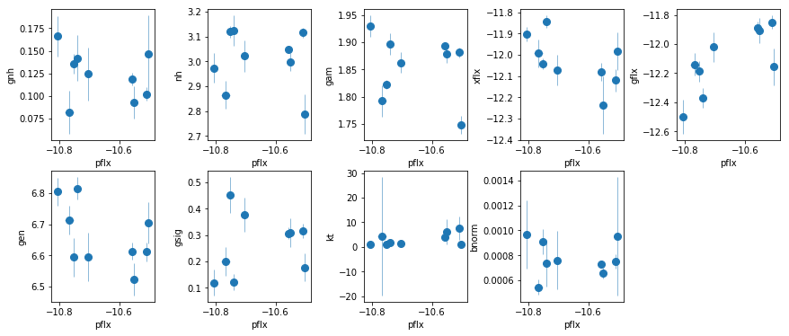
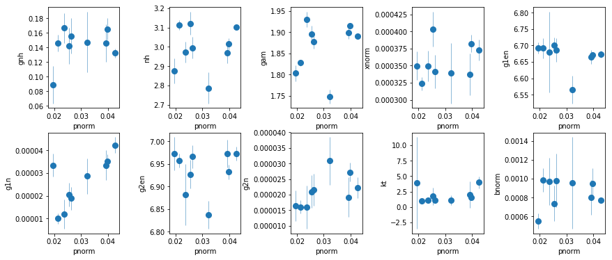
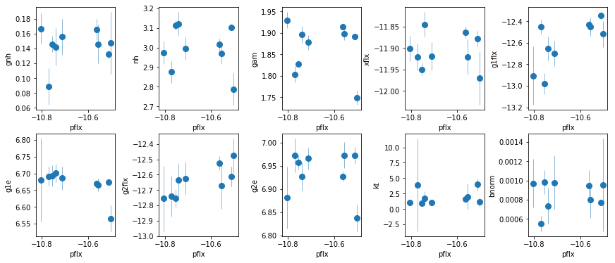
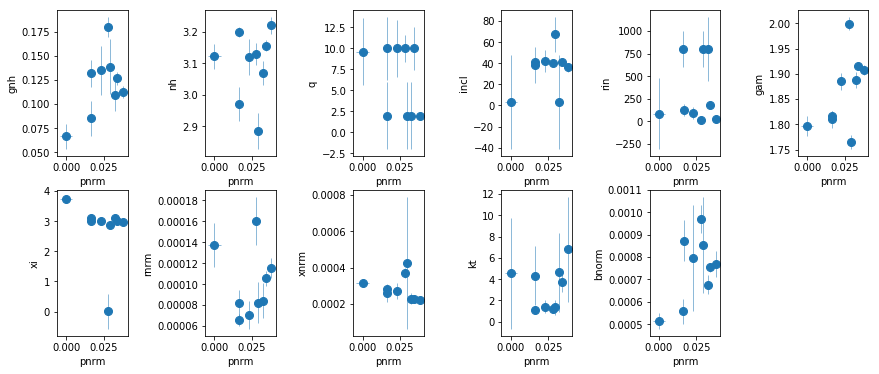

```python
import sys,os
base_dir = '/home/abzoghbi/data/ngc5506/spec_timing_paper'
data_dir = 'data/xmm'
spec_dir = 'data/xmm_spec'

sys.path.append(base_dir)
from spec_helpers import *

%load_ext autoreload
%autoreload 2
```

### Read useful data from data notebook


```python
os.chdir('%s/%s'%(base_dir, data_dir))
data = np.load('log/data.npz')
obsids = data['obsids']
spec_obsids = [i for i in obsids]
spec_data = data['spec_data']
spec_ids = [i+1 for i,o in enumerate(obsids) if o in spec_obsids]
nspec = len(spec_ids)
```

### Move the spectra to one location


```python
os.chdir(base_dir)
os.system('mkdir -p %s'%spec_dir)
os.chdir(spec_dir)
for o in spec_obsids:
    os.system('cp %s/%s/%s/pn/spec/spec_* .'%(base_dir, data_dir, o))
    os.system('cp %s/%s/%s/rgs/spec_rgs* .'%(base_dir, data_dir, o))
```

---

### Plot The spectra
- plot the unfolded spectra from all the 9 datasets.


```python
os.chdir('%s/%s'%(base_dir, spec_dir))
os.system('mkdir -p results/spec')
nspec = len(spec_obsids)
tcl = 'source ~/codes/xspec/az.tcl\n'
for ispec in spec_ids:
    tcl += ('da spec_%d.grp\n'
            'ign 0.0-.3,10.-**\nsetpl ener\n'
            'az_plot_unfold u tmp_%d pn_%d\n')%((ispec,)*3)
with open('tmp.xcm', 'w') as fp: fp.write(tcl)
cmd = 'xspec - tmp.xcm > tmp.log 2>&1'
subp.call(['/bin/bash', '-i', '-c', cmd])
os.system('cat tmp_*plot > results/spec/spec_unfold.plot')
os.system('rm tmp_*plot tmp.???')
```


    0


---

## The energy of the FeK line
- Fitting is done with `xspec`
- It uses `fit_1` in `fit.tcl`
- fix sigma of gaussian because it interferes with othe features


```python
os.chdir('%s/%s'%(base_dir, spec_dir))
os.system('mkdir -p fits')
fit_1 = fit_xspec_model('fit_1', spec_ids, base_dir)
```


```python
plt.errorbar(spec_ids, fit_1[:,2,0], fit_1[:,2,1], fmt='o', ms=8, lw=0.5)
plt.plot([0,9], [6.4]*2, lw=0.5)
```


    [<matplotlib.lines.Line2D at 0x7f864dbb9390>]





```python
_ = az.misc.simple_fit(np.array(spec_ids), fit_1[:,2,0], fit_1[:,2,1], 'const')
#fit_1[:,2,0]
```

    
    # fit(const): chi2(  27.8) pval(0.000521) conf( 0.999) sigma(  3.47)
    #    6.4 (0.00548)
    


> Consistent with 6.4 keV

---

### `fit_2`: Iron Edge at 7 keV: Model with zedge


```python
os.chdir('%s/%s'%(base_dir, spec_dir))
fit_2 = fit_xspec_model('fit_2', spec_ids, base_dir)
```


```python
# plot the result #
par_names = ['edg_e', 'edg_tau', 'gam', 'pnorm', 'gen', 'gnorm']
fit = fit_2
fig = plt.figure(figsize=(12,5))
idx = [0,1,2,3,4,5]; iref = 1
for i,ix in enumerate(idx):
    ax = plt.subplot(2,len(idx)//2,i+1)
    plt.errorbar(spec_ids, fit[:,ix,0], fit[:,ix,1], xerr=fit[:,iref,1], 
                 fmt='o', ms=8, lw=0.5)
    ax.set_xlabel('index'); ax.set_ylabel(par_names[ix])
    print(par_names[ix])
    _ = az.misc.simple_fit(np.array(spec_ids), fit[:,ix,0], fit[:,ix,1], 'const')
plt.tight_layout(pad=0)
```

    edg_e
    
    # fit(const): chi2(  9.21) pval( 0.325) conf( 0.675) sigma( 0.984)
    #   7.17 (0.0074)
    
    edg_tau
    
    # fit(const): chi2(  5.35) pval(0.7199) conf(  0.28) sigma( 0.359)
    #  0.236 (0.00388)
    
    gam
    
    # fit(const): chi2(  71.1) pval(2.945e-12) conf(   1.0) sigma(  6.98)
    #   1.32 (0.0184)
    
    pnorm
    
    # fit(const): chi2(7.45e+02) pval(   0.0) conf(   1.0) sigma(   inf)
    # 0.0104 (0.00124)
    
    gen
    
    # fit(const): chi2(  23.3) pval(0.002981) conf( 0.997) sigma(  2.97)
    #    6.4 (0.00298)
    
    gnorm
    
    # fit(const): chi2(  5.36) pval( 0.719) conf( 0.281) sigma(  0.36)
    # 5.79e-05 (1.15e-06)
    





- Edge energy consistent with neutral iron
- $\tau$ appears to be constant
- Energy of the line consistent with 6.4 keV; no gain problems

### Calculate the mean and fractional variability


```python
os.chdir('%s/%s'%(base_dir, spec_dir))

# read the spectra from spec_unfold.plot
lines = open('results/spec/spec_unfold.plot', 'r').readlines()
spectra = []
for k,g in groupby(lines, lambda x: x=='\n' or x[0] == 'd'):
    g = list(g)
    if len(g) < 5: continue
    spec = np.array([l.split() for l in g], np.double)
    if spec.shape[1] != 1: spectra.append(spec)

# map the spectra to a single energy grid
en, ene = spectra[0][:,[0,1]].T
egrid = np.array([en-ene, en+ene]).T
en_new, spectra_new = spec_common_grid(spectra, egrid)
mse = np.sum(spectra_new[:,1]**2, 0)/nspec
mean_spec = np.c_[spectra_new[:,0].mean(0), (mse/nspec)**0.5].T
fvar = (np.var(spectra_new[:,0], 0, ddof=1) - mse)**0.5 / mean_spec[0]
fvar_e = ((mse/((2*nspec)**0.5 * mean_spec[0]**2 * fvar))**2 + 
          ((mse/nspec)**0.5/mean_spec[0])**2)**0.5
fvar = np.c_[fvar, fvar_e].T
```


```python
# plot the spectra
fig, ax = plt.subplots(1, 2, figsize=(12, 5))
ax[0].errorbar(en_new[0], mean_spec[0], mean_spec[1], alpha=0.5)
ax[0].set_xscale('log')
ax[1].errorbar(en_new[0], fvar[0], fvar[1], alpha=0.5)
ax[1].set_xscale('log')
plt.tight_layout()
```





```python
# write the results #
text = '\ndescriptor en,+- spec_mean,+- spec_fvar,+- %s\n'%(' '.join(
        ['spec_%d,+-'%(i+1) for i in range(nspec)]))
text += '\n'.join(['{} {} {} {} {} {} {}'.format(en_new[0,i], en_new[1,i], 
            mean_spec[0,i], mean_spec[1,i], fvar[0,i], fvar[1,i], 
            ' '.join(['{} {}'.format(spectra_new[ii,0,i], spectra_new[ii,1,i])
                     for ii in range(nspec)])) for i in range(en_new.shape[1])])
with open('results/spec/fvar.plot', 'w') as fp: fp.write(text)
```

---
## Do line scan after adding xillver: 0.3-10 keV


```python
os.chdir('%s/%s'%(base_dir, spec_dir))
fit_xspec_model('fit_3', spec_ids, base_dir, read_fit=False, parallel=False)
```


```python
# process the scan files using proc_scan.py script
os.chdir('fits')
suff = '3'
os.system('proc_scan.py fit_%s__*scan'%suff)
os.system('mkdir -p ../results/scan')
os.system('mv veusz/*plot  ../results/scan')
os.system('mv combined*plot ../results/scan/combined_scan_%s.2d.plot'%suff)
os.system('rm -r veusz')
os.chdir('..')
```

---
## Do line scan after adding xillver: 2-10 keV


```python
os.chdir('%s/%s'%(base_dir, spec_dir))
fit_xspec_model('fit_3a', spec_ids, base_dir, read_fit=False, parallel=False)
```


```python
# do fake simulations to get the data chi2 distribution to use instead of fstat
os.chdir('%s/%s'%(base_dir, spec_dir))
fit_xspec_model('fit_3a_sim', spec_ids, base_dir, read_fit=False, ext_check='sim')
```


```python
# process the scan files using proc_scan.py script
os.chdir('fits')
suff = '3a'
os.system('proc_scan.py fit_%s__*scan'%suff)
os.system('mkdir -p ../results/scan')
os.system('mv veusz/*plot  ../results/scan')
os.system('mv combined*plot ../results/scan/combined_scan_%s.2d.plot'%suff)
os.system('rm -r veusz')
os.chdir('..')
```


```python

```

<br /> <br />

---
## `fit_4`: Xillver + broad gaussian


```python
os.chdir('%s/%s'%(base_dir, spec_dir))
fit_4 = fit_xspec_model('fit_4', spec_ids, base_dir)
```


```python
# plot the result #
par_names = ['gnh', 'nh', 'gam', 'pnorm', 'xnorm', 'gen', 'gsig', 'gnorm', 'kt', 'bnorm']
fit = fit_4
fig = plt.figure(figsize=(12,5))
idx = [0,1,2,4,5,6,7,8,9]; iref = 3
for i,ix in enumerate(idx):
    ax = plt.subplot(2,len(idx)//2+1,i+1)
    plt.errorbar(fit[:,iref,0], fit[:,ix,0], fit[:,ix,1], xerr=fit[:,iref,1], 
                 fmt='o', ms=8, lw=0.5)
    ax.set_xlabel(par_names[iref]); ax.set_ylabel(par_names[ix])
plt.tight_layout(pad=0)
```





```python
# write the residuals #
write_resid(base_dir, spec_ids, '4', '', -1, avg_bin=True, outdir='results/spec')
```

## `fit_4a`: Use fluxes in `fit_4`


```python
os.chdir('%s/%s'%(base_dir, spec_dir))
fit_4a = fit_xspec_model('fit_4a', spec_ids, base_dir)
```


```python
# plot the result #
par_names = ['gnh', 'nh', 'pflx', 'gam', 'xflx', 'gflx', 'gen', 'gsig', 'kt', 'bnorm']
fit = fit_4a
fig = plt.figure(figsize=(12,5))
idx = [0,1,3,4,5,6,7,8,9]; iref = 2
for i,ix in enumerate(idx):
    ax = plt.subplot(2,len(idx)//2+1,i+1)
    plt.errorbar(fit[:,iref,0], fit[:,ix,0], fit[:,ix,1], xerr=fit[:,iref,1], 
                 fmt='o', ms=8, lw=0.5)
    ax.set_xlabel(par_names[iref]); ax.set_ylabel(par_names[ix])
plt.tight_layout(pad=0)
```





```python
# correlation between the line flux and the total flux
x, xe = fit[:,2,0], fit[:,2,1]
y, ye = fit[:,5,0], fit[:,5,1]
nsim, ndata = (1000, len(x))
X = np.random.randn(nsim, ndata)*xe + x
Y = np.random.randn(nsim, ndata)*ye + y
sr = np.median([st.spearmanr(x,y)[0] for x,y in zip(X, Y)])
ttest = sr*np.sqrt((ndata-2)/(1-sr*sr))
tprob = 1-st.t.cdf(ttest, df=ndata-2)
print(sr, ttest, tprob)
```

    0.65 2.263009527424072 0.02903652900857434


<br /> <br />

---
## `fit_5`: Xillver + 2 narrow gaussians


```python
os.chdir('%s/%s'%(base_dir, spec_dir))
fit_5 = fit_xspec_model('fit_5', spec_ids, base_dir)
```


```python
# plot the result #
par_names = ['gnh', 'nh', 'gam', 'pnorm', 'xnorm', 'g1en', 'g1n', 'g2en', 'g2n', 'kt', 'bnorm']
fit = fit_5
fig = plt.figure(figsize=(12,5))
idx = [0,1,2,4,5,6,7,8,9,10]; iref = 3
for i,ix in enumerate(idx):
    ax = plt.subplot(2,len(idx)//2,i+1)
    plt.errorbar(fit[:,iref,0], fit[:,ix,0], fit[:,ix,1], xerr=fit[:,iref,1], 
                 fmt='o', ms=8, lw=0.5)
    ax.set_xlabel(par_names[iref]); ax.set_ylabel(par_names[ix])
plt.tight_layout(pad=0)
```





## `fit_5a`: Use fluxes in `fit_5`


```python
os.chdir('%s/%s'%(base_dir, spec_dir))
fit_5a = fit_xspec_model('fit_5a', spec_ids, base_dir)
```


```python
# plot the result #
par_names = ['gnh', 'nh', 'pflx', 'gam', 'xflx', 'g1flx', 'g1e', 'g2flx', 'g2e', 'kt', 'bnorm']
fit = fit_5a
fig = plt.figure(figsize=(12,5))
idx = [0,1,3,4,5,6,7,8,9,10]; iref = 2
for i,ix in enumerate(idx):
    ax = plt.subplot(2,len(idx)//2,i+1)
    plt.errorbar(fit[:,iref,0], fit[:,ix,0], fit[:,ix,1], xerr=fit[:,iref,1], 
                 fmt='o', ms=8, lw=0.5)
    ax.set_xlabel(par_names[iref]); ax.set_ylabel(par_names[ix])
plt.tight_layout(pad=0)
```





```python
# Line fluxes against a constant hypothesis
_ = az.misc.simple_fit(fit[:,2,0], fit[:,5,0], fit[:,5,1], 'const')
_ = az.misc.simple_fit(fit[:,2,0], fit[:,7,0], fit[:,7,1], 'const')
```

    
    # fit(const): chi2(  47.2) pval(1.406e-07) conf(   1.0) sigma(  5.26)
    #  -12.5 ( 0.052)
    
    
    # fit(const): chi2(  12.6) pval(0.1248) conf( 0.875) sigma(  1.53)
    #  -12.6 (0.0343)
    


```python
# correlation between the sum of line fluxes and the total flux
x, xe = fit[:,2,0], fit[:,2,1]
y, ye = fit[:,5,0], fit[:,5,1]
nsim, ndata = (1000, len(x))
X = np.random.randn(nsim, ndata)*xe + x
Y = np.random.randn(nsim, ndata)*ye + y
sr = np.median([st.spearmanr(x,y)[0] for x,y in zip(X, Y)])
ttest = sr*np.sqrt((ndata-2)/(1-sr*sr))
tprob = 1-st.t.cdf(ttest, df=ndata-2)
print(sr, ttest, tprob)

```

    0.5666666666666667 1.8196058996701914 0.05581649380574549


> The flux of the two lines/broad line are correlated with the continuum flux, and independent of the FeK alpha/beta line. This suggests they are indeed due to a broad line.

## `fit_6`: Fit relxill


```python
os.chdir('%s/%s'%(base_dir, spec_dir))
fit_6 = fit_xspec_model('fit_6', spec_ids, base_dir)
```


```python
# plot the result #
par_names = ['gnh', 'nh', 'q', 'incl', 'rin', 'gam', 'xi', 'rnrm', 'pnrm', 'xnrm', 
             'kt', 'bnorm']
fit = fit_6
fig = plt.figure(figsize=(12,5))
idx = [0,1,2,3,4,5,6,7,9,10,11]; iref = 8
for i,ix in enumerate(idx):
    ax = plt.subplot(2,len(idx)//2+1,i+1)
    plt.errorbar(fit[:,iref,0], fit[:,ix,0], fit[:,ix,1], xerr=fit[:,iref,1], 
                 fmt='o', ms=8, lw=0.5)
    ax.set_xlabel(par_names[iref]); ax.set_ylabel(par_names[ix])
plt.tight_layout(pad=0)
```





## `fit_7`: Similar to `fit_6` but fit all the data together.
A few notes:
- `gnh` can probably be fixed.
- `q` is hardly constrained. Fix at 3.
- `incl` is mostly 40, except for three cases where the errors are large.
- `rin` can in principle change.
- `xi` appears to be mostly at 3 or above. spec_4 is low, but steppar gives a solution at 3 that has dchi^2 of only 3.

## `fit_8`: Similar to `fit_7` but for 2-10 keV.


```python
# final fit is fit_8e
# plot variable parameters
fit_8e = np.loadtxt('fits/fit_8e.log', usecols=[0,1,2,3]) # shape=(46,4)
fit = fit_8e[[0,4,6,7]+list(range(9,45)),:] # 45 because the last param is nu constant factor
fit = fit.reshape((10,4,4)) # (nobs, npar:nh,gam,rnorm,pnorm, p+err)
```


```python
text = 'descriptor id iobs nh,+,- gam,+,- rnorm,+,- pnorm,+,-\n'
iobs = ['%d'%(i+1) for i in range(9)] + ['nu']
text+= '\n'.join(['%d "%s" %s'%(i+1, iobs[i], ' '.join(['%g %g %g'%(x[0], x[1], x[2]) 
                        for x in fit[i,:, [0,2,3]].T])) for i in range(10)])
with open('results/spec/fit_8e.plot', 'w') as fp: fp.write(text)
```


```python
!ls results/spec
```

    fit_4.plot  fontconfig	fvar.plot  fvar_wspec.pdf   spec_unfold.plot
    fit.vsz     fvar.pdf	fvar.vsz   spec_unfold.pdf  spec_unfold.vsz


```python

```
