```python
import sys,os
base_dir = '/home/abzoghbi/data/ngc5506/spec_timing_paper'
data_dir = 'data/xmm'
timing_dir = 'data/xmm_timing'

sys.path.append(base_dir)
from timing_helpers import *
%load_ext autoreload
%autoreload 2
```

    The autoreload extension is already loaded. To reload it, use:
      %reload_ext autoreload


### Read useful data from narrow line directory


```python
data_info = np.load('%s/%s/log/data.npz'%(base_dir, data_dir))
spec_obsids = data_info['spec_obsids']
lc_obsids = [i for i in spec_obsids]
obsids = data_info['obsids']
spec_data = data_info['spec_data']
spec_ids = [i+1 for i,o in enumerate(obsids) if o in spec_obsids]
lc_ids = [i for i in spec_ids]
print(lc_ids)
```

    [1, 2, 3, 4, 5, 6, 7, 8, 9]


```python
# update lc_obsids based on light curve length #
os.chdir('%s/%s'%(base_dir, timing_dir))
lcdir, ebins, dt = '1a', '2 10', 128
Lc, en, ene = read_pn_lc(lc_obsids, dt, ebins, lcdir, '%s/%s'%(base_dir, data_dir), 
                         min_exp=0.6, interp=True)
# get segment lengths without splitting #
rarr = [i for lc in Lc for i in az.LCurve.create_segments(lc, 0)]
# shape: nen, nseg, ...
rate, seg_idx = rarr[::4], rarr[3::4]
# to which obs does each segment belong?
seg_idx = np.concatenate([[i]*len(s) for i,s in enumerate(seg_idx[0])])
#rate_all, _, _, seg_idx = lc_to_segments(Lc, 0)
lengths = np.array([len(r)*dt/1e3 for r in rate[0]])
print('segment lengths (ks): ', ' | '.join(['%6.2f'%(x) for x in lengths]))
print('observations:         ', ' | '.join(['%6d'%(i) for i in seg_idx]))
```

    segment lengths (ks):   14.72 |  10.62 |  21.12 |  19.97 |  19.33 |   0.26 |  19.97 |  87.68 |  90.37 |   5.38 | 122.11
    observations:               0 |      1 |      2 |      3 |      4 |      4 |      5 |      6 |      7 |      8 |      8


```python
seglen = 0
min_len = np.int(14e3/dt)
fqbin = {'by_n': [20, 1]}
idx = np.unique(seg_idx[lengths >= 19.])
spec_ids = idx + 1
lc_obsids = [lc_obsids[i] for i in idx]
nobs = len(lc_obsids)
print('spec_ids:', np.array(spec_ids))
print('lc_obsids:', np.array(lc_obsids))
```

    spec_ids: [3 4 5 6 7 8 9]
    lc_obsids: ['0201830201' '0201830301' '0201830401' '0201830501' '0554170101'
     '0554170201' '0761220101']


## Plot light curves: 2-10 keV


```python
# read light curves #
os.chdir('%s/%s'%(base_dir, timing_dir))
lcdir, ebins, dt = '1a', '2 10', 128
Lc, en, ene = read_pn_lc(obsids, dt, ebins, lcdir, '%s/%s'%(base_dir, data_dir), 
                         min_exp=0.6, interp=True)
nen, nobs = len(Lc), len(Lc[0])
Lc = [Lc[0][i].make_even() for i in range(nobs)]

# plot #
fig = plt.figure(figsize=(12,8))
nsub = 3
for i in range(nobs):
    ax = plt.subplot(nsub, nsub+1, i+1)
    ltime = (Lc[i].time - Lc[i].time[0])/1e3
    ax.errorbar(ltime, Lc[i].rate, Lc[i].rerr, fmt='o', ms=3, alpha=0.5)
    ax.set_xlim([0,130])
plt.tight_layout()

# write ascii file #
text = ''
for i in range(nobs):
    text += '\ndescriptor time_{0} rate_{0},+-\n'.format(i+1)
    ltime = (Lc[i].time - Lc[i].time[0])/1e3
    text += '\n'.join(['{} {} {}'.format(*z) for z in zip(ltime, Lc[i].rate, Lc[i].rerr)])
with open('lc.plot', 'w') as fp: fp.write(text)
```


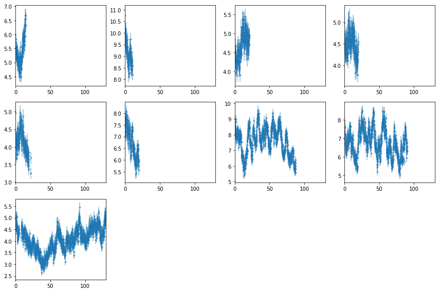


---

## Power Spectra

### The total 2-10 keV PSD


```python
wdir = '%s/%s/psd'%(base_dir, timing_dir); os.system('mkdir -p %s'%wdir); os.chdir(wdir)
lcdir, ebins, dt = '1a', '2 10', 128

# read light curves 
Lc, en, ene = read_pn_lc(lc_obsids, dt, ebins, lcdir, '%s/%s'%(base_dir, data_dir), 
                         min_exp=0.6, interp=True)
rarr = [i for lc in Lc for i in az.LCurve.create_segments(lc, seglen, 
                                    strict=False, min_seg_length=min_len)]
# shape: nen, nseg, ...
rate, rerr, tarr, seg_idx = rarr[::4], rarr[1::4], rarr[2::4], rarr[3::4]
seg_idx = np.concatenate([[i]*len(s) for i,s in enumerate(seg_idx[0])])
print('segment lengths (ks): ', ' | '.join(['%4.1f'%(len(r)*dt/1e3) for r in rate[0]]))
```

    segment lengths (ks):  21.1 | 20.0 | 19.3 | 20.0 | 87.7 | 90.4 | 122.1


```python
# plot the segments to check #
fig = plt.figure(figsize=(10,6))
for i in range(len(lc_obsids)):
    ax = plt.subplot(3, 3, i+1)
    ax.plot((Lc[0][i].time - Lc[0][i].time[0])/1e3, Lc[0][i].rate, lw=0.2)
    for j in np.arange(len(tarr[0]))[seg_idx==i]:
        ax.plot((tarr[0][j] - Lc[0][i].time[0])/1e3, rate[0][j], lw=0.2)
    ax.set_xlim([0,120])
plt.tight_layout()
```


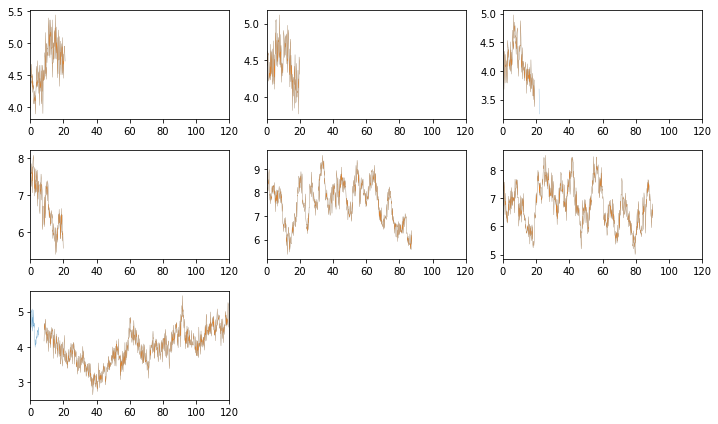


#### Calculate the total & individual PSDs
- We use Hanning tapering before calculating the psd to control against rednoise leak. see p388 Bendat & Piersol
- PSD is in rms units.
- The averaging is done in log space (Papadakis+93)
- We calculate the total and the individual psd's
- ibins is the number of frequency bins to average


```python
# total psd #
ibins = 20 # for whittle
fqbin = {'by_n': [ibins, 1]}
psd  = az.LCurve.calculate_psd(rate[0], dt, 'rms', rerr=rerr[0], taper=True)
psdb = az.LCurve.bin_psd(psd[0], psd[1], fqbin, noise=psd[2], logavg=True)
print(psdb[3]['fqm'])

# individual psd's #
ipsd, ipsdb = [], []
for io in range(len(lc_obsids)):
    ir = np.argwhere(seg_idx==io)[:,0]
    r, re  = [rate[0][i] for i in ir], [rerr[0][i] for i in ir]
    p  = az.LCurve.calculate_psd(r, dt, 'rms', rerr=re, taper=True)
    pb = az.LCurve.bin_psd(p[0], p[1], fqbin, noise=p[2], logavg=True)
    ipsd.append(p)
    ipsdb.append(pb)
```

    [20, 20, 20, 20, 20, 20, 20, 20, 20, 20, 20, 20, 20, 20, 20, 20, 20, 20, 20, 20, 20, 20, 20, 20, 20, 20, 20, 20, 20, 20, 20, 20, 20, 20, 20, 21, 20, 20, 20, 20, 20, 20, 20, 20, 20, 20, 20, 20, 20, 20, 20, 20, 20, 20, 20, 20, 20, 20, 20, 20, 20, 20, 20, 20, 20, 20, 20, 20, 20, 20, 20, 20, 20, 17]


```python
# plot the total psd, and from individual observations #
fig = plt.figure(figsize=(8,8))
for i in range(len(ipsd)):
    ax = plt.subplot(3, 3, i+1)
    ax.set_xscale('log'); ax.set_yscale('log')
    # raw psd's #
    ax.plot(psd[0], psd[1], lw=0.3, alpha=0.3)
    ax.plot(ipsd[i][0], ipsd[i][1], lw=0.6, alpha=0.6)
    # binned #
    ax.errorbar(psdb[0], psdb[1], psdb[2], fmt='-', alpha=.8)
    ax.errorbar(ipsdb[i][0], ipsdb[i][1], ipsdb[i][2], fmt='-', alpha=.8)
    plt.plot(psdb[0], psdb[3]['noise'], lw=0.5)
    plt.plot(ipsdb[i][0], ipsdb[i][3]['noise'], lw=0.5)
plt.tight_layout(pad=0)
```


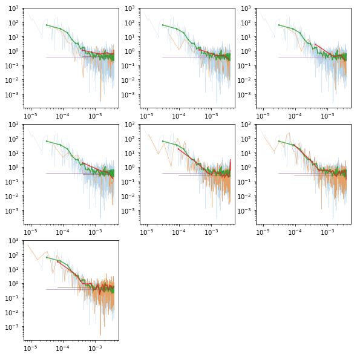


```python
# write psd to pha file and fit in xspec
fqL = np.array(psdb[-1]['fqL'])
az.misc.write_pha_spec(fqL[:-1][:-1], fqL[1:][:-1], psdb[1][:-1], psdb[2][:-1], 'psd_tot')
```

    psd_tot.pha was created successfully


```python
# po model to total #
fit_psd('psd_tot.pha', 'po', ibins, '', 'tot__po')
!cat fits/psd_tot__po.log
```

    
    # 1588.69 70 22.6955 -1
    1.2398e-01 1.2479e-02 1.2883e-02 -1.2075e-02 "PhoIndex "
    3.6563e-01 1.5767e-02 1.5369e-02 -1.6164e-02 "norm "
    1.8800e+00 8.1921e-02 7.9233e-02 -8.4608e-02 "PhoIndex "
    


```python
# lo model to total #
fit_psd('psd_tot.pha', 'lo', ibins, 'new 8 1e-5 .1 0 0', 'tot__lo')
!cat fits/psd_tot__lo.log
```

    
    # 1541.07 69 22.3344 -1
    8.1486e-02 5.0545e-03 5.3968e-03 -4.7121e-03 "PhoIndex "
    3.8736e-01 1.3432e-02 1.3644e-02 -1.3220e-02 "norm "
    4.9611e-05 9.2022e-06 8.5707e-06 -9.8337e-06 "LineE keV"
    8.7331e-05 1.0993e-05 1.1341e-05 -1.0645e-05 "Width keV"
    


```python
# bpl model to total #
# mefine bpl e^(-a1) * 1/(1 + (e/eb)^(a2-a1))
fit_psd('psd_tot.pha', 'bpl', ibins, '', 'tot__bpl')
!cat fits/psd_tot__bpl.log
```

    
    # 1541.91 69 22.3465 -1
    8.4294e-02 5.4626e-03 5.9033e-03 -5.0219e-03 "PhoIndex "
    4.1495e-01 1.4315e-02 1.4402e-02 -1.4228e-02 "norm "
    1.8591e-04 3.7317e-05 3.7010e-05 -3.7623e-05 "eb "
    3.1890e+00 3.2603e-01 3.4996e-01 -3.0211e-01 "a2 "
    


```python
# is the difference significant; compare po to bpl (as they are nested) with likelihood ratio
# https://en.wikipedia.org/wiki/Likelihood-ratio_test
lr = 2 * (1588.69 - 1571.91)
1 - st.chi2.cdf(lr, df=1)
```


    6.909920524655888e-09


### PSD for subsets of the observations:
Split into low and high flux


```python
print('segment means: ', ' | '.join(['%3.3g'%x for x in [np.nanmean(x) for x in rate[0]]]))
```

    segment means:  4.66 | 4.47 | 4.14 | 6.7 | 7.57 | 6.75 | 4.03


```python
#indv = [[0,1,2,12,13,14,15,16,17], [3,4,5,6,7,8,9,10,11]]
indv = [[0,1,2,6], [3,4,5]]
labels = ['lo', 'hi']

psd_indv = []
for i,suff in enumerate(labels):
    r  = [rate[0][i] for i in indv[i]]
    re = [rerr[0][i] for i in indv[i]]
    p  = az.LCurve.calculate_psd(r, dt, 'rms', rerr=re, taper=True)
    pb = az.LCurve.bin_psd(p[0], p[1], fqbin, noise=p[2], logavg=True)
    print(pb[-1]['fqm'])
    psd_indv.append(pb)
    
    # pha #
    fqL = np.array(pb[-1]['fqL'])
    az.misc.write_pha_spec(fqL[:-1][:-1], fqL[1:][:-1], pb[1][:-1], pb[2][:-1], 'psd_%s'%suff)
```

    [20, 20, 20, 20, 20, 20, 20, 20, 20, 20, 20, 20, 20, 20, 20, 20, 20, 20, 20, 20, 20, 20, 20, 20, 20, 20, 20, 20, 20, 20, 20, 20, 20, 20, 20, 8]
    psd_lo.pha was created successfully
    [20, 20, 20, 20, 20, 20, 20, 20, 20, 20, 20, 20, 20, 20, 20, 20, 20, 20, 20, 20, 20, 20, 20, 20, 20, 20, 20, 20, 20, 20, 20, 20, 20, 20, 20, 20, 20, 20, 10]
    psd_hi.pha was created successfully


```python
# plot 
plt.errorbar(psdb[0], psdb[1], psdb[2], fmt='-o', alpha=.8, color='C2')
for i in range(len(indv)):
    pb = psd_indv[i]
    plt.errorbar(pb[0], pb[1], pb[2], fmt='-', alpha=.8, color='C%d'%i)
    plt.plot(pb[0], pb[3]['noise'], lw=0.5, color='C%d'%i)
plt.xscale('log'); plt.yscale('log')
```


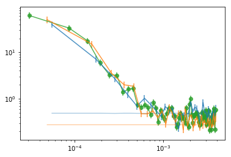


```python
# po/lo models to lo/hi #
os.system('tail -n +10 fits/psd_tot__po.xcm  > tmp_po.xcm')
os.system('tail -n +10 fits/psd_tot__lo.xcm  > tmp_lo.xcm')
os.system('tail -n +10 fits/psd_tot__bpl.xcm > tmp_bpl.xcm')
for suff in labels:
    fit_psd('psd_%s.pha'%suff, 'tmp_po.xcm',  fqbin['by_n'][0], '', '%s__po'%suff)
    fit_psd('psd_%s.pha'%suff, 'tmp_lo.xcm',  fqbin['by_n'][0], 'new 8 1e-5', '%s__lo'%suff)
    fit_psd('psd_%s.pha'%suff, 'tmp_bpl.xcm', fqbin['by_n'][0], '', '%s__bpl'%suff)

!cat fits/psd_??__po.log fits/psd_??__lo.log fits/psd_??__bpl.log
```

    
    # 855.887 35 24.4539 -1
    1.0640e-01 1.1239e-02 1.1734e-02 -1.0745e-02 "PhoIndex "
    2.8525e-01 1.9737e-02 1.8739e-02 -2.0736e-02 "norm "
    1.8035e+00 9.5020e-02 9.1706e-02 -9.8334e-02 "PhoIndex "
    
    
    # 799.459 32 24.9831 -1
    8.5064e-02 9.0076e-03 9.8694e-03 -8.1459e-03 "PhoIndex "
    4.3686e-01 2.6396e-02 2.6202e-02 -2.6589e-02 "norm "
    1.6680e+00 9.6372e-02 9.6479e-02 -9.6266e-02 "PhoIndex "
    
    
    # 832.459 34 24.4841 -1
    8.5066e-02 6.9837e-03 7.6242e-03 -6.3432e-03 "PhoIndex "
    3.1942e-01 1.6495e-02 1.6805e-02 -1.6184e-02 "norm "
    6.7536e-05 1.5298e-05 1.3782e-05 -1.6815e-05 "LineE keV"
    8.8035e-05 1.5750e-05 1.6437e-05 -1.5064e-05 "Width keV"
    
    
    # 786.084 31 25.3576 -1
    7.5418e-02 6.8950e-03 7.5731e-03 -6.2169e-03 "PhoIndex "
    4.7631e-01 2.3346e-02 2.3836e-02 -2.2857e-02 "norm "
    6.0783e-05 2.2230e-05 1.8930e-05 -2.5530e-05 "LineE keV"
    7.8988e-05 1.7803e-05 1.8475e-05 -1.7132e-05 "Width keV"
    
    
    # 834.113 34 24.5327 -1
    8.6140e-02 7.2693e-03 7.9668e-03 -6.5719e-03 "PhoIndex "
    3.4332e-01 1.8507e-02 1.8413e-02 -1.8602e-02 "norm "
    1.6744e-04 5.6632e-05 5.4680e-05 -5.8584e-05 "eb "
    3.0695e+00 4.4894e-01 4.9399e-01 -4.0389e-01 "a2 "
    
    
    # 785.334 31 25.3334 -1
    7.5382e-02 6.9316e-03 7.6080e-03 -6.2552e-03 "PhoIndex "
    4.9388e-01 2.4439e-02 2.4569e-02 -2.4310e-02 "norm "
    1.3956e-04 6.3341e-05 5.7131e-05 -6.9552e-05 "eb "
    3.0052e+00 5.2845e-01 5.7226e-01 -4.8464e-01 "a2 "
    


#### Summary plots


```python
psd_tot  = [np.loadtxt('fits/psd_tot__%s.log'%m, usecols=[0,1,2,3]) for m in ['po', 'lo', 'bpl']]
psd_indv = [[np.loadtxt('fits/psd_%s__%s.log'%(suff, m), usecols=[0,1,2,3]) 
            for suff in labels] for m in ['po', 'lo', 'bpl']]
psd_po, psd_lo, psd_bpl = [np.vstack([[psd_tot[ii]], psd_indv[ii]]) for ii in [0,1,2]]
idx = [0,1,2]
fig,ax = plt.subplots(3,3, figsize=(12,8))
for ii,ip in enumerate([0,2]):
    ax[ii,0].errorbar(idx, psd_po[:,ip,0], [-psd_po[:,ip,3], psd_po[:,ip,2]], fmt='o',capsize=4)
for ii,ip in enumerate([0,2,3]):
    ax[ii,1].errorbar(idx, psd_lo[:,ip,0], [-psd_lo[:,ip,3], psd_lo[:,ip,2]], fmt='o',capsize=4)
for ii,ip in enumerate([0,2,3]):
    ax[ii,2].errorbar(idx, psd_bpl[:,ip,0], [-psd_bpl[:,ip,3], psd_bpl[:,ip,2]], fmt='o',capsize=4)
plt.tight_layout()
```


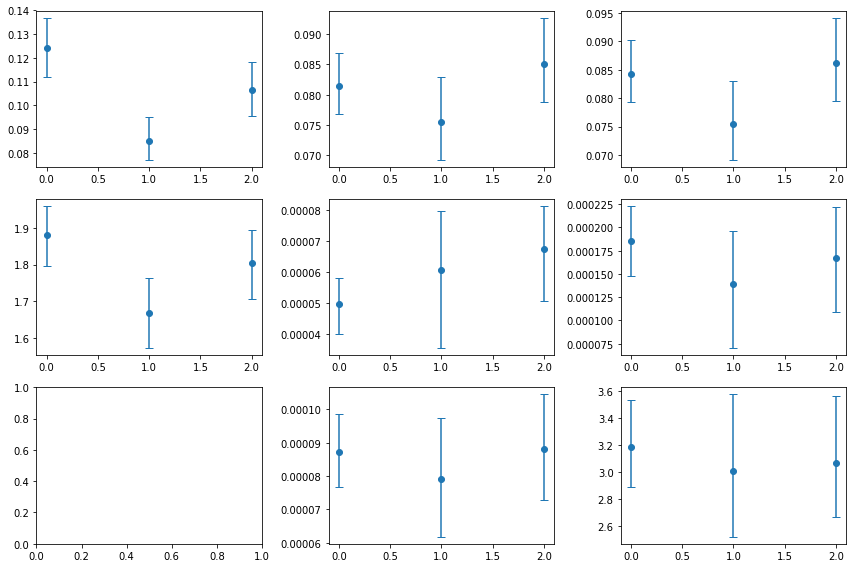


> RMS and Gamma are consistent with being constant. The lorentzian model provides a better fit for the total psd and the individual groups


```python
# is the change in rms signficant? #
pars = np.array(psd_indv[0])
x, y, ye  = np.array([1,2.]), pars[:,0,0], pars[:,0,1]
fopt, chi2, pval, nsig, text = az.misc.simple_fit(x, y, ye, 'const')
print('rms difference is significant with confidence: %g %%'%(100*(1-pval)))
```

    
    # fit(const): chi2(  2.19) pval(0.1385) conf( 0.861) sigma(  1.48)
    # 0.0934 (0.0104)
    
    rms difference is significant with confidence: 86.1484 %


---
### PSD as a function of energy: 4 bins (4a)


```python
wdir = '%s/%s/psd/4a'%(base_dir, timing_dir); os.system('mkdir -p %s'%wdir); os.chdir(wdir)
lcdir, ebins, dt = '4a', '2 4 6 7 10', 128
Lc, en, ene = read_pn_lc(lc_obsids, dt, ebins, lcdir, '%s/%s'%(base_dir, data_dir), 
                         min_exp=0.6, interp=True)
rarr = [i for lc in Lc for i in az.LCurve.create_segments(lc, seglen, 
                                        strict=False, min_seg_length=min_len)]
rate, rerr, tarr, seg_idx = rarr[::4], rarr[1::4], rarr[2::4], rarr[3::4]
print('segment lengths (ks): ', ' | '.join(['%4.1f'%(len(r)*dt/1e3) for r in rate[0]]))
```

    segment lengths (ks):  21.1 | 20.0 | 19.3 | 20.0 | 87.7 | 90.4 | 122.1


```python
# psd vs energy #
iepsdb = []
for ibin in range(len(en)):
    r, re, _, _ = az.LCurve.prepare_en_segments(rate, rerr, ibin, None)
    p  = az.LCurve.calculate_psd(r, dt, 'rms', rerr=re, taper=True)
    pb = az.LCurve.bin_psd(p[0], p[1], fqbin, noise=p[2], logavg=True)
    iepsdb.append(pb)
    
    # pha #
    fqL = np.array(pb[-1]['fqL'])
    az.misc.write_pha_spec(fqL[:-1][:-1], fqL[1:][:-1], pb[1][:-1], pb[2][:-1], 'psd_e%d'%(ibin+1))
```

    psd_e1.pha was created successfully
    psd_e2.pha was created successfully
    psd_e3.pha was created successfully
    psd_e4.pha was created successfully


```python
# plot the total psd, and from individual observations #
fig = plt.figure(figsize=(12,4))
for i in range(len(en)):
    ax = plt.subplot(1, 4, i+1)
    ax.set_xscale('log'); ax.set_yscale('log')
    # binned #
    ax.errorbar(psdb[0], psdb[1], psdb[2], fmt='-', alpha=.8)
    ax.errorbar(iepsdb[i][0], iepsdb[i][1], iepsdb[i][2], fmt='-', alpha=.8)
    plt.plot(psdb[0], psdb[3]['noise'], lw=0.5)
    plt.plot(iepsdb[i][0], iepsdb[i][3]['noise'], lw=0.5)
plt.tight_layout(pad=0)
```


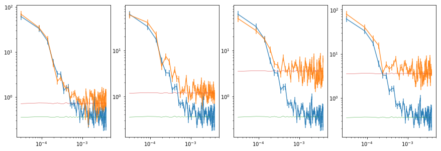


```python
# fit po model to the energy psd's #
os.system('tail -n +10 ../fits/psd_tot__po.xcm > tmp_po.xcm; mkdir -p fits')
for ie in range(len(en)):
    fit_psd('psd_e%d.pha'%(ie+1), 'tmp_po.xcm', fqbin['by_n'][0], 'new 8,,,.5 .5', 'e%d__po'%(ie+1))

!cat fits/psd_e?__po.log
```

    
    # 1700.53 70 24.2933 -1
    1.2101e-01 1.3090e-02 1.4567e-02 -1.1613e-02 "PhoIndex "
    7.8598e-01 2.7512e-02 2.7897e-02 -2.7127e-02 "norm "
    1.8961e+00 9.6602e-02 1.0034e-01 -9.2863e-02 "PhoIndex "
    
    
    # 1705.36 70 24.3623 -1
    1.0989e-01 9.9041e-03 1.0583e-02 -9.2251e-03 "PhoIndex "
    1.1112e+00 5.0238e-02 4.8868e-02 -5.1607e-02 "norm "
    1.5855e+00 9.0476e-02 9.0406e-02 -9.0546e-02 "PhoIndex "
    
    
    # 1896.82 70 27.0974 -1
    7.8933e-02 5.3554e-03 5.7507e-03 -4.9602e-03 "PhoIndex "
    3.1965e+00 1.6450e-01 1.5636e-01 -1.7264e-01 "norm "
    1.2070e+00 1.1500e-01 1.1747e-01 -1.1254e-01 "PhoIndex "
    
    
    # 1906.99 70 27.2427 -1
    9.9028e-02 8.0944e-03 8.6750e-03 -7.5137e-03 "PhoIndex "
    3.9279e+00 1.5166e-01 1.4988e-01 -1.5343e-01 "norm "
    1.4137e+00 1.1045e-01 1.1502e-01 -1.0588e-01 "PhoIndex "
    


#### Summary plots


```python
psd_tot = np.loadtxt('../fits/psd_tot__po.log', usecols=[0,1,2,3])
psd_ie  = np.array([np.loadtxt('fits/psd_e%d__po.log'%(ie+1), usecols=[0,1,2,3]) 
                    for ie in range(len(en))])
fig,ax = plt.subplots(1,2, figsize=(8,3))
for ii,ip in enumerate([0,2]):
    ax[ii].errorbar(en, psd_ie[:,ip,0], [-psd_ie[:,ip,3], psd_ie[:,ip,2]], fmt='o',capsize=4)
    ax[ii].fill_between(en, [psd_tot[ip,0]+psd_tot[ip,3]]*len(en), 
                            [psd_tot[ip,0]+psd_tot[ip,2]]*len(en) , alpha=0.5)
plt.tight_layout()
```


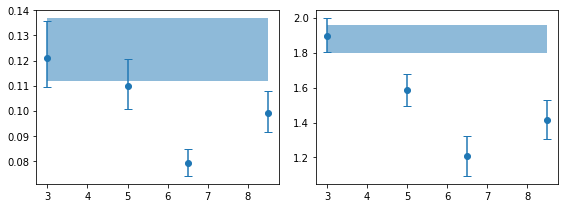


```python
# are the variaitons signficant? #
for ip,pname in zip([0,2], ['rms', 'gamma']):
    x, y, ye  = en, psd_ie[:,ip,0], psd_ie[:,ip,1]
    print('%s center variations ...'%pname)
    fopt, chi2, pval, nsig, text = az.misc.simple_fit(x, y, ye, 'const')
```

    rms center variations ...
    
    # fit(const): chi2(  14.9) pval(0.001921) conf( 0.998) sigma(   3.1)
    # 0.0921 (0.00866)
    
    gamma center variations ...
    
    # fit(const): chi2(  23.4) pval(3.396e-05) conf(   1.0) sigma(  4.15)
    #   1.56 ( 0.142)
    


```python
# fit lo model to the energy psd's #
os.system('tail -n +10 ../fits/psd_tot__lo.xcm > tmp_lo.xcm; mkdir -p fits')
for ie in range(len(en)):
    fit_psd('psd_e%d.pha'%(ie+1), 'tmp_lo.xcm', fqbin['by_n'][0], '', 'e%d__lo'%(ie+1))

!cat fits/psd_e?__lo.log
```

    
    # 1654.11 69 23.9727 -1
    8.2998e-02 5.4653e-03 5.8323e-03 -5.0983e-03 "PhoIndex "
    8.1541e-01 2.5032e-02 2.5454e-02 -2.4610e-02 "norm "
    5.2664e-05 7.6233e-06 7.0255e-06 -8.2210e-06 "LineE keV"
    6.8204e-05 1.0317e-05 1.0766e-05 -9.8672e-06 "Width keV"
    
    
    # 1668.11 69 24.1755 -1
    8.5784e-02 5.1050e-03 5.4284e-03 -4.7817e-03 "PhoIndex "
    1.2150e+00 3.9874e-02 4.0472e-02 -3.9276e-02 "norm "
    4.5554e-05 1.3541e-05 1.2124e-05 -1.4958e-05 "LineE keV"
    1.1352e-04 1.5592e-05 1.6207e-05 -1.4977e-05 "Width keV"
    
    
    # 1886.87 69 27.3459 -1
    7.2361e-02 4.8885e-03 5.1537e-03 -4.6233e-03 "PhoIndex "
    3.5397e+00 1.0833e-01 1.0909e-01 -1.0757e-01 "norm "
    3.2073e-05 2.5524e-05 1.8975e-05 -3.2073e-05 "LineE keV"
    1.1731e-04 2.4167e-05 2.5573e-05 -2.2761e-05 "Width keV"
    
    
    # 1889.48 69 27.3838 -1
    8.8067e-02 6.0412e-03 6.4126e-03 -5.6698e-03 "PhoIndex "
    4.1700e+00 1.2384e-01 1.2564e-01 -1.2204e-01 "norm "
    3.8823e-05 1.6493e-05 1.3313e-05 -1.9673e-05 "LineE keV"
    9.4204e-05 1.8537e-05 1.9728e-05 -1.7346e-05 "Width keV"
    


```python
psd_tot = np.loadtxt('../fits/psd_tot__lo.log', usecols=[0,1,2,3])
psd_ie  = np.array([np.loadtxt('fits/psd_e%d__lo.log'%(ie+1), usecols=[0,1,2,3]) 
                    for ie in range(len(en))])
fig,ax = plt.subplots(1,3, figsize=(8,3))
for ii,ip in enumerate([0,2,3]):
    ax[ii].errorbar(en, psd_ie[:,ip,0], [-psd_ie[:,ip,3], psd_ie[:,ip,2]], fmt='o',capsize=4)
    ax[ii].fill_between(en, [psd_tot[ip,0]+psd_tot[ip,3]]*len(en), 
                            [psd_tot[ip,0]+psd_tot[ip,2]]*len(en) , alpha=0.5)
plt.tight_layout()
```


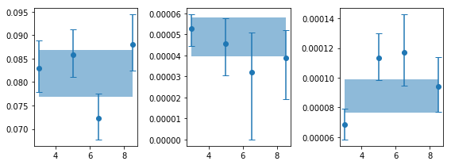


```python
# are the variaitons signficant? #
for ip,pname in zip([0,2,3], ['rms', 'lcent', 'lwidth']):
    x, y, ye  = en, psd_ie[:,ip,0], psd_ie[:,ip,1]
    print('%s center variations ...'%pname)
    fopt, chi2, pval, nsig, text = az.misc.simple_fit(x, y, ye, 'const')
```

    rms center variations ...
    
    # fit(const): chi2(  5.45) pval(0.1414) conf( 0.859) sigma(  1.47)
    # 0.0816 (0.00359)
    
    lcent center variations ...
    
    # fit(const): chi2(   1.1) pval(0.7763) conf( 0.224) sigma( 0.284)
    # 4.83e-05 (3.63e-06)
    
    lwidth center variations ...
    
    # fit(const): chi2(  7.93) pval(0.04738) conf( 0.953) sigma(  1.98)
    # 8.73e-05 (1.21e-05)
    


```python
# fit bpl model to the energy psd's #
os.system('tail -n +10 ../fits/psd_tot__bpl.xcm > tmp_bpl.xcm; mkdir -p fits')
for ie in range(len(en)):
    fit_psd('psd_e%d.pha'%(ie+1), 'tmp_bpl.xcm', fqbin['by_n'][0], '', 'e%d__bpl'%(ie+1))

!cat fits/psd_e?__bpl.log
```

    
    # 1652.41 69 23.948 -1
    8.5817e-02 5.9212e-03 6.2737e-03 -5.5688e-03 "PhoIndex "
    8.5173e-01 2.5619e-02 2.5991e-02 -2.5246e-02 "norm "
    1.6447e-04 2.7598e-05 2.7586e-05 -2.7610e-05 "eb "
    3.6963e+00 4.5388e-01 4.9720e-01 -4.1057e-01 "a2 "
    
    
    # 1672.08 69 24.2331 -1
    8.8516e-02 5.4793e-03 5.8501e-03 -5.1085e-03 "PhoIndex "
    1.2671e+00 4.1424e-02 4.1558e-02 -4.1289e-02 "norm "
    2.4628e-04 4.9725e-05 4.8948e-05 -5.0501e-05 "eb "
    3.4361e+00 6.0015e-01 6.8716e-01 -5.1314e-01 "a2 "
    
    
    # 1890.24 69 27.3947 -1
    7.2411e-02 5.7994e-03 6.1569e-03 -5.4420e-03 "PhoIndex "
    3.6427e+00 1.5140e-01 1.3056e-01 -1.7223e-01 "norm "
    2.1940e-04 5.4508e-05 5.4902e-05 -5.4114e-05 "eb "
    4.2996e+00 2.3860e+00 2.7004e+00 -2.0716e+00 "a2 "
    
    
    # 1888.63 69 27.3714 -1
    8.6417e-02 6.1542e-03 7.3093e-03 -4.9991e-03 "PhoIndex "
    4.3326e+00 1.1729e-01 1.1830e-01 -1.1627e-01 "norm "
    1.9405e-04 1.7229e-05 1.9263e-05 -1.5196e-05 "eb "
    7.0000e+00 8.0555e-01 0.0000e+00 -1.6111e+00 "a2 "
    


```python
psd_tot = np.loadtxt('../fits/psd_tot__bpl.log', usecols=[0,1,2,3])
psd_ie  = np.array([np.loadtxt('fits/psd_e%d__bpl.log'%(ie+1), usecols=[0,1,2,3]) 
                    for ie in range(len(en))])
fig,ax = plt.subplots(1,3, figsize=(8,3))
for ii,ip in enumerate([0,2,3]):
    ax[ii].errorbar(en, psd_ie[:,ip,0], [-psd_ie[:,ip,3], psd_ie[:,ip,2]], fmt='o',capsize=4)
    ax[ii].fill_between(en, [psd_tot[ip,0]+psd_tot[ip,3]]*len(en), 
                            [psd_tot[ip,0]+psd_tot[ip,2]]*len(en) , alpha=0.5)
plt.tight_layout()
```


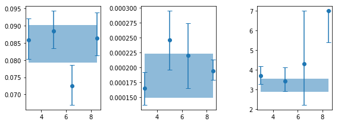


```python
# are the variaitons signficant? #
for ip,pname in zip([0,2,3], ['rms', 'fb', 'a2']):
    x, y, ye  = en, psd_ie[:,ip,0], psd_ie[:,ip,1]
    print('%s center variations ...'%pname)
    fopt, chi2, pval, nsig, text = az.misc.simple_fit(x, y, ye, 'const')
```

    rms center variations ...
    
    # fit(const): chi2(  4.87) pval(0.1817) conf( 0.818) sigma(  1.34)
    # 0.0833 (0.00371)
    
    fb center variations ...
    
    # fit(const): chi2(  2.45) pval(0.4839) conf( 0.516) sigma(   0.7)
    # 0.000192 (1.23e-05)
    
    a2 center variations ...
    
    # fit(const): chi2(  14.9) pval(0.001878) conf( 0.998) sigma(  3.11)
    #   4.18 (  0.73)
    


> Only rms and gamma variations with energy in the powerlaw case appear to be significant.

<br /> <br /> <br />

---
---
<br /> <br /> <br />
## Lag vs Frequency: 3a
- bins: `2 6 7 10`; calculate lag vs frequency relative to the 2-4 keV band


```python
wdir = '%s/%s/cross/3a'%(base_dir, timing_dir); os.system('mkdir -p %s'%wdir); os.chdir(wdir)
lcdir, ebins, dt = '3a', '2 6 7 10', 128
fqbin  = {'by_n': [20, 1.2]}
fqbin  = {'bins': 8e-6*1.7**np.arange(200), 'min_per_bin':15}
crss = calc_cross_prodcuts(lc_obsids, lcdir, dt, ebins, [seglen, min_len], fqbin=fqbin, iref=0)
print('frequency limits: ', ' | '.join(['%2.2e'%s for s in crss['crss'][0][-1]['fqL']]) )
```

    segment lengths (ks):  21.1 | 20.0 | 19.3 | 20.0 | 87.7 | 90.4 | 122.1
    energy bin indices:  [0, 1, 2]
    number of frequencies:  [ 23  17  29  52  88 148 254 427 440]
    frequency limits:  8.19e-06 | 6.84e-05 | 1.14e-04 | 1.94e-04 | 3.31e-04 | 5.59e-04 | 9.50e-04 | 1.61e-03 | 2.74e-03 | 3.90e-03


```python
# plot lags #
freq, lag = crss['freq'], crss['lag']
for ie in range(1, len(lag)):
    plt.errorbar(freq, lag[ie, 0], lag[ie, 1], fmt='o-')
plt.xscale('log')
write_cross_prodcuts(crss, nfq=None)
```

    saved products vs freq to cross_freq.plot


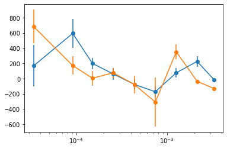


```python
# write the limits too #
l = [crss['crss'][i][-1]['limit'] for i in range(3)]
L = [crss['crss'][i][-1]['Limit'] for i in range(3)]
la= [crss['crss'][i][-1]['limit_avg'] for i in range(3)]
text = '\ndescriptor %s\n'%(' '.join(['l_%s_e%d,+- L_%s_e%d,+- la_%s_e%d,+-'%(
                    lcdir, i+1, lcdir, i+1, lcdir, i+1) for i in range(3)]))
text += '\n'.join([' '.join(['0 %g 0 %g 0 %g'%(l[i][j], L[i][j], la[i][j]) for i in range(3)]) 
                   for j in range(len(l[0]))])
with open('cross_freq.plot', 'a') as fp: fp.write(text)
```


```python
# write pha of the lag
fqL = crss['crss'][1][3]['fqL']
l = crss['lag']
az.misc.write_pha_spec(fqL[:-1], fqL[1:], l[1,0], l[1,1], 'lag_e1')
az.misc.write_pha_spec(fqL[:-1], fqL[1:], l[2,0], l[2,1], 'lag_e2')
```

    lag_e1.pha was created successfully
    lag_e2.pha was created successfully


```python
## Low/high flux
#indv = [[0,1,2,6], [3,4,5]]
#labels = ['lo', 'hi']
indv = [[0,1,2,6], [3,4,5], [4], [5], [6]]
labels = ['lo', 'hi', 's7', 's8', 's9']
```


```python
# low/high flux intervals
fig, ax = plt.subplots(1,2, figsize=(10,4))
for ilab,lab in enumerate(labels[:2]):
    crss = calc_cross_prodcuts([lc_obsids[i] for i in indv[ilab]], lcdir, 
                               dt, ebins, [seglen, min_len], fqbin=fqbin, iref=0)
    print('frequency limits: ', ' | '.join(['%2.2e'%s for s in crss['crss'][0][-1]['fqL']]) )
    freq, lag = crss['freq'], crss['lag']
    for ie in range(1, len(lag)):
        ax[ilab].errorbar(freq, lag[ie, 0], lag[ie, 1], fmt='o-')
    ax[ilab].set_xscale('log')
```

    segment lengths (ks):  21.1 | 20.0 | 19.3 | 122.1
    energy bin indices:  [0, 1, 2]
    number of frequencies:  [ 19  39  42  71 122 204 211]
    frequency limits:  8.19e-06 | 1.15e-04 | 3.31e-04 | 5.65e-04 | 9.50e-04 | 1.61e-03 | 2.74e-03 | 3.90e-03
    segment lengths (ks):  20.0 | 87.7 | 90.4
    energy bin indices:  [0, 1, 2]
    number of frequencies:  [ 21  15  27  46  77 132 223 229]
    frequency limits:  1.11e-05 | 1.14e-04 | 1.94e-04 | 3.31e-04 | 5.59e-04 | 9.52e-04 | 1.62e-03 | 2.74e-03 | 3.90e-03


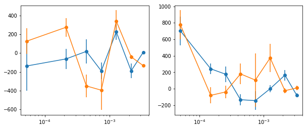


```python

```

## Cross products vs energy:
absolute-correction light curves


```python
fqbin  = {'bins': [8e-6, 1e-4, 2.6e-4, 5e-4, 8e-4]}
NFQ = 3
```


```python
fig, ax = plt.subplots(1,NFQ,figsize=(12,3))

for ib in [8, 12, 16, 24, 32, [24,2], [32,2]]:
    overlap = None
    if type(ib) == list: ib, overlap = ib
    wdir = '%s/%s/cross/%da'%(base_dir, timing_dir, ib)
    os.system('mkdir -p %s'%wdir); os.chdir(wdir)
    lcdir, ebins, dt = '%da'%ib, ' '.join(['%g'%x for x in np.logspace(np.log10(2),1,ib+1)]), 128
    crss = calc_cross_prodcuts(lc_obsids, lcdir, dt, ebins, [seglen, min_len], 
                               fqbin=fqbin, overlap=overlap)
    
    # plot & write #
    en, lag = crss['en'][0], crss['lag']
    for ii in range(NFQ):
        ax[ii].errorbar(en, lag[:, 0, ii], lag[:, 1, ii], fmt='o', color='C0')
        ax[ii].set_ylim([-800, 1000])
    plt.tight_layout()
    write_cross_prodcuts(crss, nfq=NFQ, suff=('' if overlap is None else '_o%d'%overlap))
    
```

    segment lengths (ks):  21.1 | 20.0 | 19.3 | 20.0 | 87.7 | 90.4 | 122.1
    energy bin indices:  [0, 1, 2, 3, 4, 5, 6, 7]
    number of frequencies:  [ 34  62  90 114]
    saved products vs freq to cross_en.plot
    segment lengths (ks):  21.1 | 20.0 | 19.3 | 20.0 | 87.7 | 90.4 | 122.1
    energy bin indices:  [0, 1, 2, 3, 4, 5, 6, 7, 8, 9, 10, 11]
    number of frequencies:  [ 34  62  90 114]
    saved products vs freq to cross_en.plot
    segment lengths (ks):  21.1 | 20.0 | 19.3 | 20.0 | 87.7 | 90.4 | 122.1
    energy bin indices:  [0, 1, 2, 3, 4, 5, 6, 7, 8, 9, 10, 11, 12, 13, 14, 15]
    number of frequencies:  [ 34  62  90 114]
    saved products vs freq to cross_en.plot
    segment lengths (ks):  21.1 | 20.0 | 19.3 | 20.0 | 87.7 | 90.4 | 122.1
    energy bin indices:  [0, 1, 2, 3, 4, 5, 6, 7, 8, 9, 10, 11, 12, 13, 14, 15, 16, 17, 18, 19, 20, 21, 22, 23]
    number of frequencies:  [ 34  62  90 114]
    saved products vs freq to cross_en.plot
    segment lengths (ks):  21.1 | 20.0 | 19.3 | 20.0 | 87.7 | 90.4 | 122.1
    energy bin indices:  [0, 1, 2, 3, 4, 5, 6, 7, 8, 9, 10, 11, 12, 13, 14, 15, 16, 17, 18, 19, 20, 21, 22, 23, 24, 25, 26, 27, 28, 29, 30, 31]
    number of frequencies:  [ 34  62  90 114]
    saved products vs freq to cross_en.plot
    segment lengths (ks):  21.1 | 20.0 | 19.3 | 20.0 | 87.7 | 90.4 | 122.1
    energy bin indices:  [[0, 1], [1, 2], [2, 3], [3, 4], [4, 5], [5, 6], [6, 7], [7, 8], [8, 9], [9, 10], [10, 11], [11, 12], [12, 13], [13, 14], [14, 15], [15, 16], [16, 17], [17, 18], [18, 19], [19, 20], [20, 21], [21, 22], [22, 23]]
    number of frequencies:  [ 34  62  90 114]
    saved products vs freq to cross_en_o2.plot
    segment lengths (ks):  21.1 | 20.0 | 19.3 | 20.0 | 87.7 | 90.4 | 122.1
    energy bin indices:  [[0, 1], [1, 2], [2, 3], [3, 4], [4, 5], [5, 6], [6, 7], [7, 8], [8, 9], [9, 10], [10, 11], [11, 12], [12, 13], [13, 14], [14, 15], [15, 16], [16, 17], [17, 18], [18, 19], [19, 20], [20, 21], [21, 22], [22, 23], [23, 24], [24, 25], [25, 26], [26, 27], [27, 28], [28, 29], [29, 30], [30, 31]]
    number of frequencies:  [ 34  62  90 114]
    saved products vs freq to cross_en_o2.plot


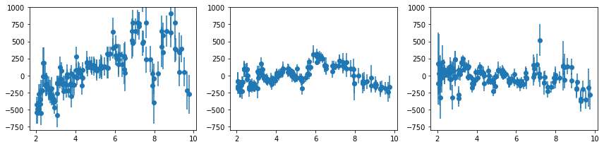


## Cross products vs energy: channel-based light curves


```python
for ib in [8, 12, 16, 24, 32]:
    wdir = '%s/%s/cross/%dch'%(base_dir, timing_dir, ib)
    os.system('mkdir -p %s'%wdir); os.chdir(wdir)
    lcdir, ebins, dt = '%dch'%ib, ' '.join(['%g'%x for x in np.linspace(2,10,ib+1)]), 128
    crss = calc_cross_prodcuts(lc_obsids, lcdir, dt, ebins, [seglen, min_len], fqbin=fqbin)
    
    os.system('cp %s/%s/../xmm_spec/spec_add_%s.???.b .'%(base_dir, timing_dir, lcdir))
    specfile = glob.glob('spec_add_%s.grp.b'%lcdir)[0]
    write_cross_prodcuts(crss, specfile=specfile, nfq=NFQ)
```

    segment lengths (ks):  21.1 | 20.0 | 19.3 | 20.0 | 87.7 | 90.4 | 122.1
    energy bin indices:  [0, 1, 2, 3, 4, 5, 6, 7]
    number of frequencies:  [ 34  62  90 114]
    saved products vs freq to cross_en.plot
    frequency limits:  8.19e-06, 1.00e-04, 2.62e-04, 5.01e-04
    segment lengths (ks):  21.1 | 20.0 | 19.3 | 20.0 | 87.7 | 90.4 | 122.1
    energy bin indices:  [0, 1, 2, 3, 4, 5, 6, 7, 8, 9, 10, 11]
    number of frequencies:  [ 34  62  90 114]
    saved products vs freq to cross_en.plot
    frequency limits:  8.19e-06, 1.00e-04, 2.62e-04, 5.01e-04
    segment lengths (ks):  21.1 | 20.0 | 19.3 | 20.0 | 87.7 | 90.4 | 122.1
    energy bin indices:  [0, 1, 2, 3, 4, 5, 6, 7, 8, 9, 10, 11, 12, 13, 14, 15]
    number of frequencies:  [ 34  62  90 114]
    saved products vs freq to cross_en.plot
    frequency limits:  8.19e-06, 1.00e-04, 2.62e-04, 5.01e-04
    segment lengths (ks):  21.1 | 20.0 | 19.3 | 20.0 | 87.7 | 90.4 | 122.1
    energy bin indices:  [0, 1, 2, 3, 4, 5, 6, 7, 8, 9, 10, 11, 12, 13, 14, 15, 16, 17, 18, 19, 20, 21, 22, 23]
    number of frequencies:  [ 34  62  90 114]
    saved products vs freq to cross_en.plot
    frequency limits:  8.19e-06, 1.00e-04, 2.62e-04, 5.01e-04
    segment lengths (ks):  21.1 | 20.0 | 19.3 | 20.0 | 87.7 | 90.4 | 122.1
    energy bin indices:  [0, 1, 2, 3, 4, 5, 6, 7, 8, 9, 10, 11, 12, 13, 14, 15, 16, 17, 18, 19, 20, 21, 22, 23, 24, 25, 26, 27, 28, 29, 30, 31]
    number of frequencies:  [ 34  62  90 114]
    saved products vs freq to cross_en.plot
    frequency limits:  8.19e-06, 1.00e-04, 2.62e-04, 5.01e-04


```python

# logspace ch #
for ib in [8, 12, 16, 24, 32, 48]:
    wdir = '%s/%s/cross/%dlch'%(base_dir, timing_dir, ib)
    os.system('mkdir -p %s'%wdir); os.chdir(wdir)
    ebins = ' '.join(['%g'%x for x in np.logspace(np.log10(2),1,ib+1)])
    lcdir, ebins, dt = '%dlch'%ib, ebins, 128
    crss = calc_cross_prodcuts(lc_obsids, lcdir, dt, ebins, [seglen, min_len], fqbin=fqbin)
    
    os.system('cp %s/%s/../xmm_spec/spec_add_%s.???.b .'%(base_dir, timing_dir, lcdir))
    specfile = glob.glob('spec_add_%s.grp.b'%lcdir)[0]
    write_cross_prodcuts(crss, specfile=specfile, nfq=NFQ)
```

    segment lengths (ks):  21.1 | 20.0 | 19.3 | 20.0 | 87.7 | 90.4 | 122.1
    energy bin indices:  [0, 1, 2, 3, 4, 5, 6, 7, 8, 9, 10, 11, 12, 13, 14, 15, 16, 17, 18, 19, 20, 21, 22, 23, 24, 25, 26, 27, 28, 29, 30, 31]
    number of frequencies:  [ 34  62  90 114]
    saved products vs freq to cross_en.plot
    frequency limits:  8.19e-06, 1.00e-04, 2.62e-04, 5.01e-04


```python
fig, ax = plt.subplots(5,NFQ,figsize=(12,6))
for ilab,lab in enumerate(labels):
    print('--- ', lab, ' ---')
    for ib in [16]:#[8, 12, 16, 24, 32, [24,2], [32,2]]:
        overlap = None
        if type(ib) == list: ib, overlap = ib
        wdir = '%s/%s/cross/%da'%(base_dir, timing_dir, ib)
        os.system('mkdir -p %s'%wdir); os.chdir(wdir)
        lcdir, ebins, dt = '%da'%ib, ' '.join(['%g'%x for x in np.logspace(np.log10(2),1,ib+1)]), 128
        crss = calc_cross_prodcuts([lc_obsids[i] for i in indv[ilab]], lcdir, dt, ebins, 
                                   [seglen, min_len], fqbin=fqbin, overlap=overlap)

        # plot & write #
        en, lag = crss['en'][0], crss['lag']
        for ii in range(NFQ):
            ax[ilab, ii].errorbar(en, lag[:, 0, ii], lag[:, 1, ii], fmt='o', color='C0')
            ax[ilab, ii].set_ylim([-800, 1000])
        plt.tight_layout()
        write_cross_prodcuts(crss, nfq=NFQ, 
                             suff='_%s'%lab + ('' if overlap is None else '_o%d'%overlap))    
```

    ---  lo  ---
    segment lengths (ks):  21.1 | 20.0 | 19.3 | 122.1
    energy bin indices:  [0, 1, 2, 3, 4, 5, 6, 7, 8, 9, 10, 11, 12, 13, 14, 15]
    number of frequencies:  [16 30 43 54]
    saved products vs freq to cross_en_lo.plot
    ---  hi  ---
    segment lengths (ks):  20.0 | 87.7 | 90.4
    energy bin indices:  [0, 1, 2, 3, 4, 5, 6, 7, 8, 9, 10, 11, 12, 13, 14, 15]
    number of frequencies:  [18 32 47 60]
    saved products vs freq to cross_en_hi.plot
    ---  s7  ---
    segment lengths (ks):  87.7
    energy bin indices:  [0, 1, 2, 3, 4, 5, 6, 7, 8, 9, 10, 11, 12, 13, 14, 15]
    number of frequencies:  [ 8 14 21 27]
    saved products vs freq to cross_en_s7.plot
    ---  s8  ---
    segment lengths (ks):  90.4
    energy bin indices:  [0, 1, 2, 3, 4, 5, 6, 7, 8, 9, 10, 11, 12, 13, 14, 15]
    number of frequencies:  [ 9 14 22 27]
    saved products vs freq to cross_en_s8.plot
    ---  s9  ---
    segment lengths (ks):  122.1
    energy bin indices:  [0, 1, 2, 3, 4, 5, 6, 7, 8, 9, 10, 11, 12, 13, 14, 15]
    number of frequencies:  [12 19 30 36]
    saved products vs freq to cross_en_s9.plot


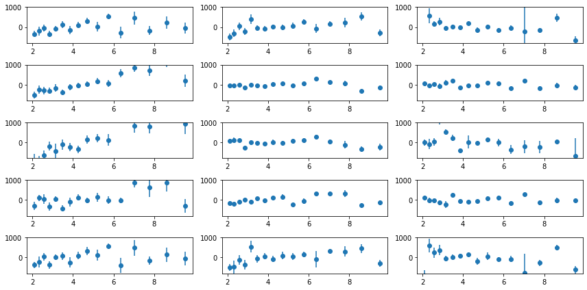


```python
#fqbin = {'by_n': [10, 2]}
for ilab,lab in enumerate(labels):
    print('--- ', lab, ' ---')
    for ib in [8, 12, 16, 24, 32]:
        wdir = '%s/%s/cross/%dch'%(base_dir, timing_dir, ib)
        os.system('mkdir -p %s'%wdir); os.chdir(wdir)
        ebins = ' '.join(['%g'%x for x in np.logspace(np.log10(2),1,ib+1)])
        lcdir, ebins, dt = '%dch'%ib, ebins, 128
        crss = calc_cross_prodcuts([lc_obsids[i] for i in indv[ilab]], lcdir, dt, ebins, 
                                   [seglen, min_len], fqbin=fqbin)
        
        
        chans_from_avg_spec(spec_ids[indv[ilab]], np.linspace(2,10,ib+1), 
                        suff='_%s_%s'%(lcdir, lab))
        os.system('cp %s/%s/../xmm_spec/spec_add_%s_%s.???.b .'%(base_dir, timing_dir, lcdir, lab))
        specfile = glob.glob('spec_add_%s_%s.grp.b'%(lcdir, lab))[0]
        write_cross_prodcuts(crss, specfile=specfile, nfq=NFQ, suff='_%s'%(lab))
        #break

```

    ---  lo  ---
    segment lengths (ks):  21.1 | 20.0 | 19.3 | 122.1
    energy bin indices:  [0, 1, 2, 3, 4, 5, 6, 7]
    number of frequencies:  [16 30 43 54]
    files spec_add_8ch_lo.??? created.
    chans: 400 600 800 1000 1200 1400 1600 1800 2000
    saved products vs freq to cross_en_lo.plot
    frequency limits:  8.19e-06, 1.00e-04, 2.62e-04, 5.01e-04
    segment lengths (ks):  21.1 | 20.0 | 19.3 | 122.1
    energy bin indices:  [0, 1, 2, 3, 4, 5, 6, 7, 8, 9, 10, 11]
    number of frequencies:  [16 30 43 54]
    files spec_add_12ch_lo.??? created.
    chans: 400 534 667 800 934 1067 1200 1334 1467 1600 1734 1867 2000
    saved products vs freq to cross_en_lo.plot
    frequency limits:  8.19e-06, 1.00e-04, 2.62e-04, 5.01e-04
    segment lengths (ks):  21.1 | 20.0 | 19.3 | 122.1
    energy bin indices:  [0, 1, 2, 3, 4, 5, 6, 7, 8, 9, 10, 11, 12, 13, 14, 15]
    number of frequencies:  [16 30 43 54]
    files spec_add_16ch_lo.??? created.
    chans: 400 500 600 700 800 900 1000 1100 1200 1300 1400 1500 1600 1700 1800 1900 2000
    saved products vs freq to cross_en_lo.plot
    frequency limits:  8.19e-06, 1.00e-04, 2.62e-04, 5.01e-04
    segment lengths (ks):  21.1 | 20.0 | 19.3 | 122.1
    energy bin indices:  [0, 1, 2, 3, 4, 5, 6, 7, 8, 9, 10, 11, 12, 13, 14, 15, 16, 17, 18, 19, 20, 21, 22, 23]
    number of frequencies:  [16 30 43 54]
    files spec_add_24ch_lo.??? created.
    chans: 400 467 534 600 667 734 800 867 934 1000 1067 1134 1200 1267 1334 1400 1467 1534 1600 1667 1734 1800 1867 1934 2000
    saved products vs freq to cross_en_lo.plot
    frequency limits:  8.19e-06, 1.00e-04, 2.62e-04, 5.01e-04
    segment lengths (ks):  21.1 | 20.0 | 19.3 | 122.1
    energy bin indices:  [0, 1, 2, 3, 4, 5, 6, 7, 8, 9, 10, 11, 12, 13, 14, 15, 16, 17, 18, 19, 20, 21, 22, 23, 24, 25, 26, 27, 28, 29, 30, 31]
    number of frequencies:  [16 30 43 54]
    files spec_add_32ch_lo.??? created.
    chans: 400 450 500 550 600 650 700 750 800 850 900 950 1000 1050 1100 1150 1200 1250 1300 1350 1400 1450 1500 1550 1600 1650 1700 1750 1800 1850 1900 1950 2000
    saved products vs freq to cross_en_lo.plot
    frequency limits:  8.19e-06, 1.00e-04, 2.62e-04, 5.01e-04
    ---  hi  ---
    segment lengths (ks):  20.0 | 87.7 | 90.4
    energy bin indices:  [0, 1, 2, 3, 4, 5, 6, 7]
    number of frequencies:  [18 32 47 60]
    files spec_add_8ch_hi.??? created.
    chans: 400 600 800 1000 1200 1400 1600 1800 2000
    saved products vs freq to cross_en_hi.plot
    frequency limits:  1.11e-05, 1.00e-04, 2.62e-04, 5.01e-04
    segment lengths (ks):  20.0 | 87.7 | 90.4
    energy bin indices:  [0, 1, 2, 3, 4, 5, 6, 7, 8, 9, 10, 11]
    number of frequencies:  [18 32 47 60]
    files spec_add_12ch_hi.??? created.
    chans: 400 534 667 800 934 1067 1200 1334 1467 1600 1734 1867 2000
    saved products vs freq to cross_en_hi.plot
    frequency limits:  1.11e-05, 1.00e-04, 2.62e-04, 5.01e-04
    segment lengths (ks):  20.0 | 87.7 | 90.4
    energy bin indices:  [0, 1, 2, 3, 4, 5, 6, 7, 8, 9, 10, 11, 12, 13, 14, 15]
    number of frequencies:  [18 32 47 60]
    files spec_add_16ch_hi.??? created.
    chans: 400 500 600 700 800 900 1000 1100 1200 1300 1400 1500 1600 1700 1800 1900 2000
    saved products vs freq to cross_en_hi.plot
    frequency limits:  1.11e-05, 1.00e-04, 2.62e-04, 5.01e-04
    segment lengths (ks):  20.0 | 87.7 | 90.4
    energy bin indices:  [0, 1, 2, 3, 4, 5, 6, 7, 8, 9, 10, 11, 12, 13, 14, 15, 16, 17, 18, 19, 20, 21, 22, 23]
    number of frequencies:  [18 32 47 60]
    files spec_add_24ch_hi.??? created.
    chans: 400 467 534 600 667 734 800 867 934 1000 1067 1134 1200 1267 1334 1400 1467 1534 1600 1667 1734 1800 1867 1934 2000
    saved products vs freq to cross_en_hi.plot
    frequency limits:  1.11e-05, 1.00e-04, 2.62e-04, 5.01e-04
    segment lengths (ks):  20.0 | 87.7 | 90.4
    energy bin indices:  [0, 1, 2, 3, 4, 5, 6, 7, 8, 9, 10, 11, 12, 13, 14, 15, 16, 17, 18, 19, 20, 21, 22, 23, 24, 25, 26, 27, 28, 29, 30, 31]
    number of frequencies:  [18 32 47 60]
    files spec_add_32ch_hi.??? created.
    chans: 400 450 500 550 600 650 700 750 800 850 900 950 1000 1050 1100 1150 1200 1250 1300 1350 1400 1450 1500 1550 1600 1650 1700 1750 1800 1850 1900 1950 2000
    saved products vs freq to cross_en_hi.plot
    frequency limits:  1.11e-05, 1.00e-04, 2.62e-04, 5.01e-04
    ---  s7  ---
    segment lengths (ks):  87.7
    energy bin indices:  [0, 1, 2, 3, 4, 5, 6, 7]
    number of frequencies:  [ 8 14 21 27]
    files spec_add_8ch_s7.??? created.
    chans: 400 600 800 1000 1200 1400 1600 1800 2000
    saved products vs freq to cross_en_s7.plot
    frequency limits:  1.14e-05, 1.03e-04, 2.62e-04, 5.02e-04
    segment lengths (ks):  87.7
    energy bin indices:  [0, 1, 2, 3, 4, 5, 6, 7, 8, 9, 10, 11]
    number of frequencies:  [ 8 14 21 27]
    files spec_add_12ch_s7.??? created.
    chans: 400 534 667 800 934 1067 1200 1334 1467 1600 1734 1867 2000
    saved products vs freq to cross_en_s7.plot
    frequency limits:  1.14e-05, 1.03e-04, 2.62e-04, 5.02e-04
    segment lengths (ks):  87.7
    energy bin indices:  [0, 1, 2, 3, 4, 5, 6, 7, 8, 9, 10, 11, 12, 13, 14, 15]
    number of frequencies:  [ 8 14 21 27]
    files spec_add_16ch_s7.??? created.
    chans: 400 500 600 700 800 900 1000 1100 1200 1300 1400 1500 1600 1700 1800 1900 2000
    saved products vs freq to cross_en_s7.plot
    frequency limits:  1.14e-05, 1.03e-04, 2.62e-04, 5.02e-04
    segment lengths (ks):  87.7
    energy bin indices:  [0, 1, 2, 3, 4, 5, 6, 7, 8, 9, 10, 11, 12, 13, 14, 15, 16, 17, 18, 19, 20, 21, 22, 23]
    number of frequencies:  [ 8 14 21 27]
    files spec_add_24ch_s7.??? created.
    chans: 400 467 534 600 667 734 800 867 934 1000 1067 1134 1200 1267 1334 1400 1467 1534 1600 1667 1734 1800 1867 1934 2000
    saved products vs freq to cross_en_s7.plot
    frequency limits:  1.14e-05, 1.03e-04, 2.62e-04, 5.02e-04
    segment lengths (ks):  87.7
    energy bin indices:  [0, 1, 2, 3, 4, 5, 6, 7, 8, 9, 10, 11, 12, 13, 14, 15, 16, 17, 18, 19, 20, 21, 22, 23, 24, 25, 26, 27, 28, 29, 30, 31]
    number of frequencies:  [ 8 14 21 27]
    files spec_add_32ch_s7.??? created.
    chans: 400 450 500 550 600 650 700 750 800 850 900 950 1000 1050 1100 1150 1200 1250 1300 1350 1400 1450 1500 1550 1600 1650 1700 1750 1800 1850 1900 1950 2000
    saved products vs freq to cross_en_s7.plot
    frequency limits:  1.14e-05, 1.03e-04, 2.62e-04, 5.02e-04
    ---  s8  ---
    segment lengths (ks):  90.4
    energy bin indices:  [0, 1, 2, 3, 4, 5, 6, 7]
    number of frequencies:  [ 9 14 22 27]
    files spec_add_8ch_s8.??? created.
    chans: 400 600 800 1000 1200 1400 1600 1800 2000
    saved products vs freq to cross_en_s8.plot
    frequency limits:  1.11e-05, 1.11e-04, 2.66e-04, 5.09e-04
    segment lengths (ks):  90.4
    energy bin indices:  [0, 1, 2, 3, 4, 5, 6, 7, 8, 9, 10, 11]
    number of frequencies:  [ 9 14 22 27]
    files spec_add_12ch_s8.??? created.
    chans: 400 534 667 800 934 1067 1200 1334 1467 1600 1734 1867 2000
    saved products vs freq to cross_en_s8.plot
    frequency limits:  1.11e-05, 1.11e-04, 2.66e-04, 5.09e-04
    segment lengths (ks):  90.4
    energy bin indices:  [0, 1, 2, 3, 4, 5, 6, 7, 8, 9, 10, 11, 12, 13, 14, 15]
    number of frequencies:  [ 9 14 22 27]
    files spec_add_16ch_s8.??? created.
    chans: 400 500 600 700 800 900 1000 1100 1200 1300 1400 1500 1600 1700 1800 1900 2000
    saved products vs freq to cross_en_s8.plot
    frequency limits:  1.11e-05, 1.11e-04, 2.66e-04, 5.09e-04
    segment lengths (ks):  90.4
    energy bin indices:  [0, 1, 2, 3, 4, 5, 6, 7, 8, 9, 10, 11, 12, 13, 14, 15, 16, 17, 18, 19, 20, 21, 22, 23]
    number of frequencies:  [ 9 14 22 27]
    files spec_add_24ch_s8.??? created.
    chans: 400 467 534 600 667 734 800 867 934 1000 1067 1134 1200 1267 1334 1400 1467 1534 1600 1667 1734 1800 1867 1934 2000
    saved products vs freq to cross_en_s8.plot
    frequency limits:  1.11e-05, 1.11e-04, 2.66e-04, 5.09e-04
    segment lengths (ks):  90.4
    energy bin indices:  [0, 1, 2, 3, 4, 5, 6, 7, 8, 9, 10, 11, 12, 13, 14, 15, 16, 17, 18, 19, 20, 21, 22, 23, 24, 25, 26, 27, 28, 29, 30, 31]
    number of frequencies:  [ 9 14 22 27]
    files spec_add_32ch_s8.??? created.
    chans: 400 450 500 550 600 650 700 750 800 850 900 950 1000 1050 1100 1150 1200 1250 1300 1350 1400 1450 1500 1550 1600 1650 1700 1750 1800 1850 1900 1950 2000
    saved products vs freq to cross_en_s8.plot
    frequency limits:  1.11e-05, 1.11e-04, 2.66e-04, 5.09e-04
    ---  s9  ---
    segment lengths (ks):  122.1
    energy bin indices:  [0, 1, 2, 3, 4, 5, 6, 7]
    number of frequencies:  [12 19 30 36]
    files spec_add_8ch_s9.??? created.
    chans: 400 600 800 1000 1200 1400 1600 1800 2000
    saved products vs freq to cross_en_s9.plot
    frequency limits:  8.19e-06, 1.06e-04, 2.62e-04, 5.08e-04
    segment lengths (ks):  122.1
    energy bin indices:  [0, 1, 2, 3, 4, 5, 6, 7, 8, 9, 10, 11]
    number of frequencies:  [12 19 30 36]
    files spec_add_12ch_s9.??? created.
    chans: 400 534 667 800 934 1067 1200 1334 1467 1600 1734 1867 2000
    saved products vs freq to cross_en_s9.plot
    frequency limits:  8.19e-06, 1.06e-04, 2.62e-04, 5.08e-04
    segment lengths (ks):  122.1
    energy bin indices:  [0, 1, 2, 3, 4, 5, 6, 7, 8, 9, 10, 11, 12, 13, 14, 15]
    number of frequencies:  [12 19 30 36]
    files spec_add_16ch_s9.??? created.
    chans: 400 500 600 700 800 900 1000 1100 1200 1300 1400 1500 1600 1700 1800 1900 2000
    saved products vs freq to cross_en_s9.plot
    frequency limits:  8.19e-06, 1.06e-04, 2.62e-04, 5.08e-04
    segment lengths (ks):  122.1
    energy bin indices:  [0, 1, 2, 3, 4, 5, 6, 7, 8, 9, 10, 11, 12, 13, 14, 15, 16, 17, 18, 19, 20, 21, 22, 23]
    number of frequencies:  [12 19 30 36]
    files spec_add_24ch_s9.??? created.
    chans: 400 467 534 600 667 734 800 867 934 1000 1067 1134 1200 1267 1334 1400 1467 1534 1600 1667 1734 1800 1867 1934 2000
    saved products vs freq to cross_en_s9.plot
    frequency limits:  8.19e-06, 1.06e-04, 2.62e-04, 5.08e-04
    segment lengths (ks):  122.1
    energy bin indices:  [0, 1, 2, 3, 4, 5, 6, 7, 8, 9, 10, 11, 12, 13, 14, 15, 16, 17, 18, 19, 20, 21, 22, 23, 24, 25, 26, 27, 28, 29, 30, 31]
    number of frequencies:  [12 19 30 36]
    files spec_add_32ch_s9.??? created.
    chans: 400 450 500 550 600 650 700 750 800 850 900 950 1000 1050 1100 1150 1200 1250 1300 1350 1400 1450 1500 1550 1600 1650 1700 1750 1800 1850 1900 1950 2000
    saved products vs freq to cross_en_s9.plot
    frequency limits:  8.19e-06, 1.06e-04, 2.62e-04, 5.08e-04


```python
#fqbin = {'by_n': [10, 2]}
for ilab,lab in enumerate(labels):
    print('--- ', lab, ' ---')
    for ib in [8, 12, 16, 24, 32, 48]:
        wdir = '%s/%s/cross/%dlch'%(base_dir, timing_dir, ib)
        os.system('mkdir -p %s'%wdir); os.chdir(wdir)
        ebins = ' '.join(['%g'%x for x in np.logspace(np.log10(2),1,ib+1)])
        lcdir, ebins, dt = '%dlch'%ib, ebins, 128
        crss = calc_cross_prodcuts([lc_obsids[i] for i in indv[ilab]], lcdir, dt, ebins, 
                                   [seglen, min_len], fqbin=fqbin)
        
        
        chans_from_avg_spec(spec_ids[indv[ilab]], np.logspace(np.log10(2),1,ib+1), 
                        suff='_%s_%s'%(lcdir, lab))
        os.system('cp %s/%s/../xmm_spec/spec_add_%s_%s.???.b .'%(base_dir, timing_dir, lcdir, lab))
        specfile = glob.glob('spec_add_%s_%s.grp.b'%(lcdir, lab))[0]
        write_cross_prodcuts(crss, specfile=specfile, nfq=NFQ, suff='_%s'%(lab))
        #break

```

    ---  lo  ---
    segment lengths (ks):  21.1 | 20.0 | 19.3 | 122.1
    energy bin indices:  [0, 1, 2, 3, 4, 5, 6, 7]
    number of frequencies:  [16 30 43 54]
    files spec_add_8lch_lo.??? created.
    chans: 400 490 599 732 895 1094 1338 1636 2000
    saved products vs freq to cross_en_lo.plot
    frequency limits:  8.19e-06, 1.00e-04, 2.62e-04, 5.01e-04
    segment lengths (ks):  21.1 | 20.0 | 19.3 | 122.1
    energy bin indices:  [0, 1, 2, 3, 4, 5, 6, 7, 8, 9, 10, 11]
    number of frequencies:  [16 30 43 54]
    files spec_add_12lch_lo.??? created.
    chans: 400 458 524 599 684 783 895 1023 1170 1338 1530 1749 2000
    saved products vs freq to cross_en_lo.plot
    frequency limits:  8.19e-06, 1.00e-04, 2.62e-04, 5.01e-04
    segment lengths (ks):  21.1 | 20.0 | 19.3 | 122.1
    energy bin indices:  [0, 1, 2, 3, 4, 5, 6, 7, 8, 9, 10, 11, 12, 13, 14, 15]
    number of frequencies:  [16 30 43 54]
    files spec_add_16lch_lo.??? created.
    chans: 400 443 490 541 599 662 732 809 895 990 1094 1210 1338 1480 1636 1809 2000
    saved products vs freq to cross_en_lo.plot
    frequency limits:  8.19e-06, 1.00e-04, 2.62e-04, 5.01e-04
    segment lengths (ks):  21.1 | 20.0 | 19.3 | 122.1
    energy bin indices:  [0, 1, 2, 3, 4, 5, 6, 7, 8, 9, 10, 11, 12, 13, 14, 15, 16, 17, 18, 19, 20, 21, 22, 23]
    number of frequencies:  [16 30 43 54]
    files spec_add_24lch_lo.??? created.
    chans: 400 428 458 490 524 560 599 640 684 732 783 837 895 957 1023 1094 1170 1251 1338 1431 1530 1636 1749 1871 2000
    saved products vs freq to cross_en_lo.plot
    frequency limits:  8.19e-06, 1.00e-04, 2.62e-04, 5.01e-04
    segment lengths (ks):  21.1 | 20.0 | 19.3 | 122.1
    energy bin indices:  [0, 1, 2, 3, 4, 5, 6, 7, 8, 9, 10, 11, 12, 13, 14, 15, 16, 17, 18, 19, 20, 21, 22, 23, 24, 25, 26, 27, 28, 29, 30, 31]
    number of frequencies:  [16 30 43 54]
    files spec_add_32lch_lo.??? created.
    chans: 400 421 443 466 490 515 541 569 599 629 662 696 732 770 809 851 895 941 990 1041 1094 1151 1210 1272 1338 1407 1480 1556 1636 1720 1809 1902 2000
    saved products vs freq to cross_en_lo.plot
    frequency limits:  8.19e-06, 1.00e-04, 2.62e-04, 5.01e-04
    segment lengths (ks):  21.1 | 20.0 | 19.3 | 122.1
    energy bin indices:  [0, 1, 2, 3, 4, 5, 6, 7, 8, 9, 10, 11, 12, 13, 14, 15, 16, 17, 18, 19, 20, 21, 22, 23, 24, 25, 26, 27, 28, 29, 30, 31, 32, 33, 34, 35, 36, 37, 38, 39, 40, 41, 42, 43, 44, 45, 46, 47]
    number of frequencies:  [16 30 43 54]
    files spec_add_48lch_lo.??? created.
    chans: 400 414 428 443 458 473 490 506 524 541 560 579 599 619 640 662 684 708 732 757 783 809 837 865 895 925 957 990 1023 1058 1094 1132 1170 1210 1251 1294 1338 1384 1431 1480 1530 1582 1636 1692 1749 1809 1871 1935 2000
    saved products vs freq to cross_en_lo.plot
    frequency limits:  8.19e-06, 1.00e-04, 2.62e-04, 5.01e-04
    ---  hi  ---
    segment lengths (ks):  20.0 | 87.7 | 90.4
    energy bin indices:  [0, 1, 2, 3, 4, 5, 6, 7]
    number of frequencies:  [18 32 47 60]
    files spec_add_8lch_hi.??? created.
    chans: 400 490 599 732 895 1094 1338 1636 2000
    saved products vs freq to cross_en_hi.plot
    frequency limits:  1.11e-05, 1.00e-04, 2.62e-04, 5.01e-04
    segment lengths (ks):  20.0 | 87.7 | 90.4
    energy bin indices:  [0, 1, 2, 3, 4, 5, 6, 7, 8, 9, 10, 11]
    number of frequencies:  [18 32 47 60]
    files spec_add_12lch_hi.??? created.
    chans: 400 458 524 599 684 783 895 1023 1170 1338 1530 1749 2000
    saved products vs freq to cross_en_hi.plot
    frequency limits:  1.11e-05, 1.00e-04, 2.62e-04, 5.01e-04
    segment lengths (ks):  20.0 | 87.7 | 90.4
    energy bin indices:  [0, 1, 2, 3, 4, 5, 6, 7, 8, 9, 10, 11, 12, 13, 14, 15]
    number of frequencies:  [18 32 47 60]
    files spec_add_16lch_hi.??? created.
    chans: 400 443 490 541 599 662 732 809 895 990 1094 1210 1338 1480 1636 1809 2000
    saved products vs freq to cross_en_hi.plot
    frequency limits:  1.11e-05, 1.00e-04, 2.62e-04, 5.01e-04
    segment lengths (ks):  20.0 | 87.7 | 90.4
    energy bin indices:  [0, 1, 2, 3, 4, 5, 6, 7, 8, 9, 10, 11, 12, 13, 14, 15, 16, 17, 18, 19, 20, 21, 22, 23]
    number of frequencies:  [18 32 47 60]
    files spec_add_24lch_hi.??? created.
    chans: 400 428 458 490 524 560 599 640 684 732 783 837 895 957 1023 1094 1170 1251 1338 1431 1530 1636 1749 1871 2000
    saved products vs freq to cross_en_hi.plot
    frequency limits:  1.11e-05, 1.00e-04, 2.62e-04, 5.01e-04
    segment lengths (ks):  20.0 | 87.7 | 90.4
    energy bin indices:  [0, 1, 2, 3, 4, 5, 6, 7, 8, 9, 10, 11, 12, 13, 14, 15, 16, 17, 18, 19, 20, 21, 22, 23, 24, 25, 26, 27, 28, 29, 30, 31]
    number of frequencies:  [18 32 47 60]
    files spec_add_32lch_hi.??? created.
    chans: 400 421 443 466 490 515 541 569 599 629 662 696 732 770 809 851 895 941 990 1041 1094 1151 1210 1272 1338 1407 1480 1556 1636 1720 1809 1902 2000
    saved products vs freq to cross_en_hi.plot
    frequency limits:  1.11e-05, 1.00e-04, 2.62e-04, 5.01e-04
    segment lengths (ks):  20.0 | 87.7 | 90.4
    energy bin indices:  [0, 1, 2, 3, 4, 5, 6, 7, 8, 9, 10, 11, 12, 13, 14, 15, 16, 17, 18, 19, 20, 21, 22, 23, 24, 25, 26, 27, 28, 29, 30, 31, 32, 33, 34, 35, 36, 37, 38, 39, 40, 41, 42, 43, 44, 45, 46, 47]
    number of frequencies:  [18 32 47 60]
    files spec_add_48lch_hi.??? created.
    chans: 400 414 428 443 458 473 490 506 524 541 560 579 599 619 640 662 684 708 732 757 783 809 837 865 895 925 957 990 1023 1058 1094 1132 1170 1210 1251 1294 1338 1384 1431 1480 1530 1582 1636 1692 1749 1809 1871 1935 2000
    saved products vs freq to cross_en_hi.plot
    frequency limits:  1.11e-05, 1.00e-04, 2.62e-04, 5.01e-04
    ---  s7  ---
    segment lengths (ks):  87.7
    energy bin indices:  [0, 1, 2, 3, 4, 5, 6, 7]
    number of frequencies:  [ 8 14 21 27]
    files spec_add_8lch_s7.??? created.
    chans: 400 490 599 732 895 1094 1338 1636 2000
    saved products vs freq to cross_en_s7.plot
    frequency limits:  1.14e-05, 1.03e-04, 2.62e-04, 5.02e-04
    segment lengths (ks):  87.7
    energy bin indices:  [0, 1, 2, 3, 4, 5, 6, 7, 8, 9, 10, 11]
    number of frequencies:  [ 8 14 21 27]
    files spec_add_12lch_s7.??? created.
    chans: 400 458 524 599 684 783 895 1023 1170 1338 1530 1749 2000
    saved products vs freq to cross_en_s7.plot
    frequency limits:  1.14e-05, 1.03e-04, 2.62e-04, 5.02e-04
    segment lengths (ks):  87.7
    energy bin indices:  [0, 1, 2, 3, 4, 5, 6, 7, 8, 9, 10, 11, 12, 13, 14, 15]
    number of frequencies:  [ 8 14 21 27]
    files spec_add_16lch_s7.??? created.
    chans: 400 443 490 541 599 662 732 809 895 990 1094 1210 1338 1480 1636 1809 2000
    saved products vs freq to cross_en_s7.plot
    frequency limits:  1.14e-05, 1.03e-04, 2.62e-04, 5.02e-04
    segment lengths (ks):  87.7
    energy bin indices:  [0, 1, 2, 3, 4, 5, 6, 7, 8, 9, 10, 11, 12, 13, 14, 15, 16, 17, 18, 19, 20, 21, 22, 23]
    number of frequencies:  [ 8 14 21 27]
    files spec_add_24lch_s7.??? created.
    chans: 400 428 458 490 524 560 599 640 684 732 783 837 895 957 1023 1094 1170 1251 1338 1431 1530 1636 1749 1871 2000
    saved products vs freq to cross_en_s7.plot
    frequency limits:  1.14e-05, 1.03e-04, 2.62e-04, 5.02e-04
    segment lengths (ks):  87.7
    energy bin indices:  [0, 1, 2, 3, 4, 5, 6, 7, 8, 9, 10, 11, 12, 13, 14, 15, 16, 17, 18, 19, 20, 21, 22, 23, 24, 25, 26, 27, 28, 29, 30, 31]
    number of frequencies:  [ 8 14 21 27]
    files spec_add_32lch_s7.??? created.
    chans: 400 421 443 466 490 515 541 569 599 629 662 696 732 770 809 851 895 941 990 1041 1094 1151 1210 1272 1338 1407 1480 1556 1636 1720 1809 1902 2000
    saved products vs freq to cross_en_s7.plot
    frequency limits:  1.14e-05, 1.03e-04, 2.62e-04, 5.02e-04
    segment lengths (ks):  87.7
    energy bin indices:  [0, 1, 2, 3, 4, 5, 6, 7, 8, 9, 10, 11, 12, 13, 14, 15, 16, 17, 18, 19, 20, 21, 22, 23, 24, 25, 26, 27, 28, 29, 30, 31, 32, 33, 34, 35, 36, 37, 38, 39, 40, 41, 42, 43, 44, 45, 46, 47]
    number of frequencies:  [ 8 14 21 27]
    files spec_add_48lch_s7.??? created.
    chans: 400 414 428 443 458 473 490 506 524 541 560 579 599 619 640 662 684 708 732 757 783 809 837 865 895 925 957 990 1023 1058 1094 1132 1170 1210 1251 1294 1338 1384 1431 1480 1530 1582 1636 1692 1749 1809 1871 1935 2000
    saved products vs freq to cross_en_s7.plot
    frequency limits:  1.14e-05, 1.03e-04, 2.62e-04, 5.02e-04
    ---  s8  ---
    segment lengths (ks):  90.4
    energy bin indices:  [0, 1, 2, 3, 4, 5, 6, 7]
    number of frequencies:  [ 9 14 22 27]
    files spec_add_8lch_s8.??? created.
    chans: 400 490 599 732 895 1094 1338 1636 2000
    saved products vs freq to cross_en_s8.plot
    frequency limits:  1.11e-05, 1.11e-04, 2.66e-04, 5.09e-04
    segment lengths (ks):  90.4
    energy bin indices:  [0, 1, 2, 3, 4, 5, 6, 7, 8, 9, 10, 11]
    number of frequencies:  [ 9 14 22 27]
    files spec_add_12lch_s8.??? created.
    chans: 400 458 524 599 684 783 895 1023 1170 1338 1530 1749 2000
    saved products vs freq to cross_en_s8.plot
    frequency limits:  1.11e-05, 1.11e-04, 2.66e-04, 5.09e-04
    segment lengths (ks):  90.4
    energy bin indices:  [0, 1, 2, 3, 4, 5, 6, 7, 8, 9, 10, 11, 12, 13, 14, 15]
    number of frequencies:  [ 9 14 22 27]
    files spec_add_16lch_s8.??? created.
    chans: 400 443 490 541 599 662 732 809 895 990 1094 1210 1338 1480 1636 1809 2000
    saved products vs freq to cross_en_s8.plot
    frequency limits:  1.11e-05, 1.11e-04, 2.66e-04, 5.09e-04
    segment lengths (ks):  90.4
    energy bin indices:  [0, 1, 2, 3, 4, 5, 6, 7, 8, 9, 10, 11, 12, 13, 14, 15, 16, 17, 18, 19, 20, 21, 22, 23]
    number of frequencies:  [ 9 14 22 27]
    files spec_add_24lch_s8.??? created.
    chans: 400 428 458 490 524 560 599 640 684 732 783 837 895 957 1023 1094 1170 1251 1338 1431 1530 1636 1749 1871 2000
    saved products vs freq to cross_en_s8.plot
    frequency limits:  1.11e-05, 1.11e-04, 2.66e-04, 5.09e-04
    segment lengths (ks):  90.4
    energy bin indices:  [0, 1, 2, 3, 4, 5, 6, 7, 8, 9, 10, 11, 12, 13, 14, 15, 16, 17, 18, 19, 20, 21, 22, 23, 24, 25, 26, 27, 28, 29, 30, 31]
    number of frequencies:  [ 9 14 22 27]
    files spec_add_32lch_s8.??? created.
    chans: 400 421 443 466 490 515 541 569 599 629 662 696 732 770 809 851 895 941 990 1041 1094 1151 1210 1272 1338 1407 1480 1556 1636 1720 1809 1902 2000
    saved products vs freq to cross_en_s8.plot
    frequency limits:  1.11e-05, 1.11e-04, 2.66e-04, 5.09e-04
    segment lengths (ks):  90.4
    energy bin indices:  [0, 1, 2, 3, 4, 5, 6, 7, 8, 9, 10, 11, 12, 13, 14, 15, 16, 17, 18, 19, 20, 21, 22, 23, 24, 25, 26, 27, 28, 29, 30, 31, 32, 33, 34, 35, 36, 37, 38, 39, 40, 41, 42, 43, 44, 45, 46, 47]
    number of frequencies:  [ 9 14 22 27]
    files spec_add_48lch_s8.??? created.
    chans: 400 414 428 443 458 473 490 506 524 541 560 579 599 619 640 662 684 708 732 757 783 809 837 865 895 925 957 990 1023 1058 1094 1132 1170 1210 1251 1294 1338 1384 1431 1480 1530 1582 1636 1692 1749 1809 1871 1935 2000
    saved products vs freq to cross_en_s8.plot
    frequency limits:  1.11e-05, 1.11e-04, 2.66e-04, 5.09e-04
    ---  s9  ---
    segment lengths (ks):  122.1
    energy bin indices:  [0, 1, 2, 3, 4, 5, 6, 7]
    number of frequencies:  [12 19 30 36]
    files spec_add_8lch_s9.??? created.
    chans: 400 490 599 732 895 1094 1338 1636 2000
    saved products vs freq to cross_en_s9.plot
    frequency limits:  8.19e-06, 1.06e-04, 2.62e-04, 5.08e-04
    segment lengths (ks):  122.1
    energy bin indices:  [0, 1, 2, 3, 4, 5, 6, 7, 8, 9, 10, 11]
    number of frequencies:  [12 19 30 36]
    files spec_add_12lch_s9.??? created.
    chans: 400 458 524 599 684 783 895 1023 1170 1338 1530 1749 2000
    saved products vs freq to cross_en_s9.plot
    frequency limits:  8.19e-06, 1.06e-04, 2.62e-04, 5.08e-04
    segment lengths (ks):  122.1
    energy bin indices:  [0, 1, 2, 3, 4, 5, 6, 7, 8, 9, 10, 11, 12, 13, 14, 15]
    number of frequencies:  [12 19 30 36]
    files spec_add_16lch_s9.??? created.
    chans: 400 443 490 541 599 662 732 809 895 990 1094 1210 1338 1480 1636 1809 2000
    saved products vs freq to cross_en_s9.plot
    frequency limits:  8.19e-06, 1.06e-04, 2.62e-04, 5.08e-04
    segment lengths (ks):  122.1
    energy bin indices:  [0, 1, 2, 3, 4, 5, 6, 7, 8, 9, 10, 11, 12, 13, 14, 15, 16, 17, 18, 19, 20, 21, 22, 23]
    number of frequencies:  [12 19 30 36]
    files spec_add_24lch_s9.??? created.
    chans: 400 428 458 490 524 560 599 640 684 732 783 837 895 957 1023 1094 1170 1251 1338 1431 1530 1636 1749 1871 2000
    saved products vs freq to cross_en_s9.plot
    frequency limits:  8.19e-06, 1.06e-04, 2.62e-04, 5.08e-04
    segment lengths (ks):  122.1
    energy bin indices:  [0, 1, 2, 3, 4, 5, 6, 7, 8, 9, 10, 11, 12, 13, 14, 15, 16, 17, 18, 19, 20, 21, 22, 23, 24, 25, 26, 27, 28, 29, 30, 31]
    number of frequencies:  [12 19 30 36]
    files spec_add_32lch_s9.??? created.
    chans: 400 421 443 466 490 515 541 569 599 629 662 696 732 770 809 851 895 941 990 1041 1094 1151 1210 1272 1338 1407 1480 1556 1636 1720 1809 1902 2000
    saved products vs freq to cross_en_s9.plot
    frequency limits:  8.19e-06, 1.06e-04, 2.62e-04, 5.08e-04
    segment lengths (ks):  122.1
    energy bin indices:  [0, 1, 2, 3, 4, 5, 6, 7, 8, 9, 10, 11, 12, 13, 14, 15, 16, 17, 18, 19, 20, 21, 22, 23, 24, 25, 26, 27, 28, 29, 30, 31, 32, 33, 34, 35, 36, 37, 38, 39, 40, 41, 42, 43, 44, 45, 46, 47]
    number of frequencies:  [12 19 30 36]
    files spec_add_48lch_s9.??? created.
    chans: 400 414 428 443 458 473 490 506 524 541 560 579 599 619 640 662 684 708 732 757 783 809 837 865 895 925 957 990 1023 1058 1094 1132 1170 1210 1251 1294 1338 1384 1431 1480 1530 1582 1636 1692 1749 1809 1871 1935 2000
    saved products vs freq to cross_en_s9.plot
    frequency limits:  8.19e-06, 1.06e-04, 2.62e-04, 5.08e-04


<br /> <br />

---
## Modeling the covariance spectrum


```python
# first, model the average added spectrum
bsuff = '16lch'
os.chdir('%s/%s/cross/%s'%(base_dir, timing_dir, bsuff))
os.system('mkdir -p fits plots')
procs = []
for suff in ['', '_lo', '_hi']:#, '_s7', '_s8', '_s9']:
    tcl  = 'source %s/fit.tcl\nfit_add "%s%s"\nexit\n'%(base_dir, bsuff, suff)
    with open('tmp%s.xcm'%suff, 'w') as fp: fp.write(tcl)
    cmd = 'xspec - tmp%s.xcm > tmp%s.log 2>&1'%(suff, suff)
    procs.append(subp.Popen(['/bin/bash', '-i', '-c', cmd]))
for p in procs: p.wait()
```


```python
# then fit the covariance.
for suff in ['', '_lo', '_hi']:#:, '_s7', '_s8', '_s9']:
    tcl = 'source %s/fit.tcl\nfit_cov "%s" %s'%(base_dir, suff, bsuff)
    with open('tmp%s.xcm'%suff, 'w') as fp: fp.write(tcl)
    cmd = 'xspec - tmp%s.xcm > tmp%s.log 2>&1'%(suff, suff)
    p = subp.call(['/bin/bash', '-i', '-c', cmd])
```

### repeat for the relativistic model 


```python
# first, model the average added spectrum
bsuff = '16lch'
os.chdir('%s/%s/cross/%s'%(base_dir, timing_dir, bsuff))
os.system('mkdir -p fits plots')
procs = []
for suff in ['', '_lo', '_hi']:#, '_s7', '_s8', '_s9']:
    tcl  = 'source %s/fit.tcl\nfit_add_rel "%s%s"\nexit\n'%(base_dir, bsuff, suff)
    with open('tmp%s.xcm'%suff, 'w') as fp: fp.write(tcl)
    cmd = 'xspec - tmp%s.xcm > tmp%s.log 2>&1'%(suff, suff)
    procs.append(subp.Popen(['/bin/bash', '-i', '-c', cmd]))
for p in procs: p.wait()
```


```python
# then fit the covariance.
for suff in ['', '_lo', '_hi']:#:, '_s7', '_s8', '_s9']:
    tcl = 'source %s/fit.tcl\nfit_cov_rel "%s" %s'%(base_dir, suff, bsuff)
    with open('tmp%s.xcm'%suff, 'w') as fp: fp.write(tcl)
    cmd = 'xspec - tmp%s.xcm > tmp%s.log 2>&1'%(suff, suff)
    p = subp.call(['/bin/bash', '-i', '-c', cmd])
```

### repeat for the Compton-thin model 


```python
# first, model the average added spectrum
bsuff = '16lch'
os.chdir('%s/%s/cross/%s'%(base_dir, timing_dir, bsuff))
procs = []
for suff in ['', '_lo', '_hi']:#, '_s7', '_s8', '_s9']:
    tcl  = 'source %s/fit.tcl\nfit_add_thin "%s%s"\nexit\n'%(base_dir, bsuff, suff)
    with open('tmp%s.xcm'%suff, 'w') as fp: fp.write(tcl)
    cmd = 'xspec - tmp%s.xcm > tmp%s.log 2>&1'%(suff, suff)
    procs.append(subp.Popen(['/bin/bash', '-i', '-c', cmd]))
for p in procs: p.wait()
```


```python
# then fit the covariance.
for suff in ['', '_lo', '_hi']:#:, '_s7', '_s8', '_s9']:
    tcl = 'source %s/fit.tcl\nfit_cov_thin "%s" %s'%(base_dir, suff, bsuff)
    with open('tmp%s.xcm'%suff, 'w') as fp: fp.write(tcl)
    cmd = 'xspec - tmp%s.xcm > tmp%s.log 2>&1'%(suff, suff)
    p = subp.call(['/bin/bash', '-i', '-c', cmd])
```

### repeat for the Compton-thin model-2 (inside absorber)


```python
# first, model the average added spectrum
bsuff = '16lch'
os.chdir('%s/%s/cross/%s'%(base_dir, timing_dir, bsuff))
procs = []
for suff in ['', '_lo', '_hi']:#, '_s7', '_s8', '_s9']:
    tcl  = 'source %s/fit.tcl\nfit_add_thin2 "%s%s"\nexit\n'%(base_dir, bsuff, suff)
    with open('tmp%s.xcm'%suff, 'w') as fp: fp.write(tcl)
    cmd = 'xspec - tmp%s.xcm > tmp%s.log 2>&1'%(suff, suff)
    procs.append(subp.Popen(['/bin/bash', '-i', '-c', cmd]))
for p in procs: p.wait()
```


```python
# then fit the covariance.
for suff in ['', '_lo', '_hi']:#:, '_s7', '_s8', '_s9']:
    tcl = 'source %s/fit.tcl\nfit_cov_thin2 "%s" %s'%(base_dir, suff, bsuff)
    with open('tmp%s.xcm'%suff, 'w') as fp: fp.write(tcl)
    cmd = 'xspec - tmp%s.xcm > tmp%s.log 2>&1'%(suff, suff)
    p = subp.call(['/bin/bash', '-i', '-c', cmd])
```

### repeat for the thermal plasma model


```python
# first, model the average added spectrum
bsuff = '16lch'
os.chdir('%s/%s/cross/%s'%(base_dir, timing_dir, bsuff))
procs = []
for suff in ['', '_lo', '_hi']:#, '_s7', '_s8', '_s9']:
    tcl  = 'source %s/fit.tcl\nfit_add_therm "%s%s"\nexit\n'%(base_dir, bsuff, suff)
    with open('tmp%s.xcm'%suff, 'w') as fp: fp.write(tcl)
    cmd = 'xspec - tmp%s.xcm > tmp%s.log 2>&1'%(suff, suff)
    procs.append(subp.Popen(['/bin/bash', '-i', '-c', cmd]))
for p in procs: p.wait()
```


```python
# then fit the covariance.
for suff in ['', '_lo', '_hi']:#:, '_s7', '_s8', '_s9']:
    tcl = 'source %s/fit.tcl\nfit_cov_therm "%s" %s'%(base_dir, suff, bsuff)
    with open('tmp%s.xcm'%suff, 'w') as fp: fp.write(tcl)
    cmd = 'xspec - tmp%s.xcm > tmp%s.log 2>&1'%(suff, suff)
    p = subp.call(['/bin/bash', '-i', '-c', cmd])
```


```python

```

### plot fit components to get reflection fraction #


```python
# energy spectra
bsuff = '16lch'
extra = '_thin2' # '', '_rel', '_thin', '_therm', '_thin2'
os.chdir('%s/%s/cross/%s'%(base_dir, timing_dir, bsuff))
for suff in ['', '_lo', '_hi']:
    tcl = 'source %s/fit.tcl\nplot_components spec_add%s_%s%s'%(base_dir, extra, bsuff, suff)
    with open('tmp%s.xcm'%suff, 'w') as fp: fp.write(tcl)
    cmd = 'xspec - tmp%s.xcm > tmp%s.log 2>&1'%(suff, suff)
    p = subp.call(['/bin/bash', '-i', '-c', cmd])
```


```python
# covariance spectra
bsuff = '16lch'
extra = '_thin2' # '', '_rel', '_thin', '_therm', '_thin2'
os.chdir('%s/%s/cross/%s'%(base_dir, timing_dir, bsuff))
for suff in ['', '_lo', '_hi']:
    for f in [1,2]:
        tcl = 'source %s/fit.tcl\nplot_components cov_add%s%s_f%d_m2'%(base_dir, extra,suff, f)
        with open('tmp%s.xcm'%suff, 'w') as fp: fp.write(tcl)
        cmd = 'xspec - tmp%s.xcm > tmp%s.log 2>&1'%(suff, suff)
        p = subp.call(['/bin/bash', '-i', '-c', cmd])
```

### explore the reflection fraction


```python
bsuff, nbins = '16lch', 16
os.chdir('%s/%s/cross/%s'%(base_dir, timing_dir, bsuff))
rfrac = {}
for extra in ['', '_rel', '_thin', '_therm', '_thin2']:
    for suff in ['', '_lo', '_hi']:
        # energy spec #
        d = np.loadtxt('fits/spec_add%s_%s%s.plot.dat'%(extra, bsuff, suff))
        d2 = d.reshape((d.shape[0]//nbins,nbins,-1))
        po = d2[:,:,-3 if extra in ['_thin', '_therm', '_thin2'] else -2]
        re = d2[:,:,-2 if extra in ['_thin', '_therm', '_thin2'] else -3]
        rf = re/po
        rq = np.quantile(rf, [0.5, 0.1587, 1-0.1587, 0.9, 0.997], axis=0)
        rfrac['spec%s%s'%(extra,suff)] = [rf, rq, re, po]

        # cov spec #
        for f in [1, 2]:
            d = np.loadtxt('fits/cov_add%s%s_f%d_m2.plot.dat'%(extra, suff, f))
            d2 = d.reshape((d.shape[0]//nbins,nbins,-1))
            po = d2[:,:,-2 if extra in ['_thin', '_therm', '_thin2'] else -1]
            re = d2[:,:,-1 if extra in ['_thin', '_therm', '_thin2'] else -2]
            rf = re/po
            rq = np.quantile(rf, [0.5, 0.1587, 1-0.1587, 0.9, 0.99], axis=0)
            rfrac['cov%s%s_f%d'%(extra,suff,f)] = [rf, rq, re, po]
np.savez('fits/rfrac.npz', rfrac=rfrac)
```


```python
fig, ax = plt.subplots(15,3, figsize=(8,24))
rfrac = np.load('fits/rfrac.npz', allow_pickle=1)['rfrac'][()]
for iplt, suff in enumerate(['', '_hi', '_lo']):
    iy = 0
    for e in ['', '_rel', '_thin', '_therm', '_thin2']:
        for tt in ['spec%s%s', 'cov%s%s_f1', 'cov%s%s_f2']:
            rf, rq, re, po = rfrac[tt%(e, suff)]
            axx = ax[iy, iplt]; iy+= 1
            axx.errorbar(np.arange(16), rq[0], [rq[0]-rq[1], rq[2]-rq[0]])
            axx.plot(np.arange(16), rq[3], '-.')
            axx.plot(np.arange(16), rq[4], ':')
            #axx.plot(rq[0])
            #plt.fill_between(rq[1], rq[2], alpha=0.3)
            axx.set_ylim([-0.05, 0.3])
            axx.set_title(tt%(e, suff))
plt.tight_layout(pad=0)
```


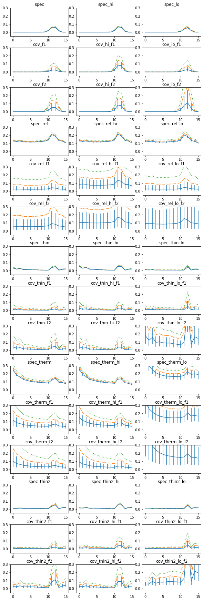


```python
# print upper limits
conf = 90
ic = 3 if conf==90 else 4
for k in rfrac.keys():
    if k[0] == 's':
        print(k, rfrac[k][1][0][11], (rfrac[k][1][0][11]-rfrac[k][1][1][11]+ 
                                     rfrac[k][1][2][11]-rfrac[k][1][0][11])/2)
    else:
        print(k, '%3.3g'%rfrac[k][1][ic][11])
```

    spec 0.054308395673555915 0.003708270764105355
    cov_f1 0.0613
    cov_f2 0.138
    spec_lo 0.03735887375982115 0.006638948034037587
    cov_lo_f1 0.0556
    cov_lo_f2 0.22
    spec_hi 0.06405335949803731 0.004273369111856065
    cov_hi_f1 0.141
    cov_hi_f2 0.173
    spec_rel 0.2079566917427467 0.00756829562600804
    cov_rel_f1 0.131
    cov_rel_f2 0.307
    spec_rel_lo 0.20241321793517603 0.016144986669994865
    cov_rel_lo_f1 0.157
    cov_rel_lo_f2 0.59
    spec_rel_hi 0.21236457235719258 0.010186854000528808
    cov_rel_hi_f1 0.296
    cov_rel_hi_f2 0.45
    spec_thin 0.036202259240141615 0.004623831418487247
    cov_thin_f1 0.0355
    cov_thin_f2 0.1
    spec_thin_lo 0.006480728108863993 0.0016833831859789784
    cov_thin_lo_f1 0.0256
    cov_thin_lo_f2 0.22
    spec_thin_hi 0.051953486303947305 0.004304652785869542
    cov_thin_hi_f1 0.0623
    cov_thin_hi_f2 0.0988
    spec_therm 0.12147085252323012 0.008568156782817651
    cov_therm_f1 0.115
    cov_therm_f2 0.103
    spec_therm_lo 0.17845495293751124 0.03516465828410435
    cov_therm_lo_f1 0.275
    cov_therm_lo_f2 0.384
    spec_therm_hi 0.13126306760295037 0.010153025016239131
    cov_therm_hi_f1 0.142
    cov_therm_hi_f2 0.115
    spec_thin2 0.0350326360640456 0.005549593458606766
    cov_thin2_f1 0.0472
    cov_thin2_f2 0.173
    spec_thin2_lo 0.006714564415891318 0.0016545619070082568
    cov_thin2_lo_f1 0.023
    cov_thin2_lo_f2 0.229
    spec_thin2_hi 0.05277734569545299 0.004259744897132829
    cov_thin2_hi_f1 0.0904
    cov_thin2_hi_f2 0.169


### Apply lag correction
- use the errors from spec and spec_rel, and the upper limits from cov
- focus on _hi, as it has the highest signa lag.


```python
# read lag data
os.chdir('%s/%s/cross/16a'%(base_dir, timing_dir))
en, ene = np.loadtxt('cross_en_hi.plot', skiprows=2, max_rows=16).T
ldata =np.loadtxt('cross_en_hi.plot', skiprows=71, max_rows=16)
lag, lage = ldata[:,2], ldata[:,3]
print(lag.shape)
```

    (16,)


```python
# apply ref. fraction correction

# this function compares the model (a shifted/stretched verions of r-fraction)
# to the data (lag)
def func(x, rm, lag, lage, rs=0):
    m = x[0] + rm * x[1]
    c2 = np.sum((lag - m)**2 / (lage**2 + rs**2))
    return c2

def func2(x, en, rm, lag, lage, rs=0):
    m = x[0]*en + x[1] + rm*x[2]
    c2 = np.sum((lag - m)**2 / (lage**2 + rs**2))
    return c2

fig, ax = plt.subplots(1,5,figsize=(10,4))
keys = ['spec_hi', 'spec_rel_hi', 'spec_thin_hi', 'spec_therm_hi', 'spec_thin2_hi']
text = 'descriptor en_hi_f2,+- lag_hi_f2_d,+-\n'
text += '\n'.join(['%g %g %g %g'%z for z in zip(en,ene,lag,lage)])
for ik,k in enumerate(keys):
    rf, rq, re, po = rfrac[k]
    rm, rs = np.mean(rf, 0), np.std(rf, 0)
    
    x0 = [0.1, 200.0]
    p = opt.minimize(func, x0, args=(rm, lag, lage, rs))
    #p = opt.minimize(func, x0, args=(en, rm, lag, lage, rs))
    x, xe = p.x, (np.diag(p.hess_inv))**0.5
    print(p, x, xe)
    c2, df = p.fun, len(en)-len(x)
    print('chi2, df, chi2_nu, p: ', c2, df, c2/df, 1-st.chi2.cdf(c2, df=df))
    mod = p.x[0] + rm * p.x[1]
    #mod = p.x[0]*en + p.x[1] + rm*p.x[2]
    text += '\ndescriptor lag_hi_f2_m__%s\n'%k
    text += '\n'.join(['%g'%m for m in mod])
    ax[ik].errorbar(en, lag, lage)
    ax[ik].plot(en, mod)
with open('lag_en_hi_f2__fit.plot', 'w') as fp: fp.write(text)
```

          fun: 19.530649760117463
     hess_inv: array([[ 1.74545450e+02, -3.16904185e+03],
           [-3.16904185e+03,  3.38035070e+05]])
          jac: array([9.53674316e-07, 0.00000000e+00])
      message: 'Optimization terminated successfully.'
         nfev: 100
          nit: 17
         njev: 25
       status: 0
      success: True
            x: array([ -56.18256222, 4975.32097998]) [ -56.18256222 4975.32097998] [ 13.211565   581.40783425]
    chi2, df, chi2_nu, p:  19.530649760117463 14 1.3950464114369616 0.1456468973344529
          fun: 18.69847064223731
     hess_inv: array([[  3322.07603107, -23854.46461441],
           [-23854.46461441, 179129.58068956]])
          jac: array([ 0.00000000e+00, -2.38418579e-07])
      message: 'Optimization terminated successfully.'
         nfev: 92
          nit: 14
         njev: 23
       status: 0
      success: True
            x: array([-495.22962772, 3650.01367106]) [-495.22962772 3650.01367106] [ 57.63745337 423.23702661]
    chi2, df, chi2_nu, p:  18.69847064223731 14 1.3356050458740936 0.17679374148333604
          fun: 44.47026113706804
     hess_inv: array([[ 4.20018403e+02, -1.23862371e+04],
           [-1.23862371e+04,  5.53264514e+05]])
          jac: array([ 4.76837158e-07, -4.76837158e-07])
      message: 'Optimization terminated successfully.'
         nfev: 96
          nit: 15
         njev: 24
       status: 0
      success: True
            x: array([ -86.57982034, 3486.50684612]) [ -86.57982034 3486.50684612] [ 20.4943505  743.81752713]
    chi2, df, chi2_nu, p:  44.47026113706804 14 3.1764472240762887 4.970536405446424e-05
          fun: 55.9458509991057
     hess_inv: array([[ 1209.7846832 , -8467.35402393],
           [-8467.35402393, 67541.6362206 ]])
          jac: array([-1.43051147e-06, -9.53674316e-07])
      message: 'Optimization terminated successfully.'
         nfev: 68
          nit: 7
         njev: 17
       status: 0
      success: True
            x: array([-16.34093804,  68.52429349]) [-16.34093804  68.52429349] [ 34.78195916 259.88773773]
    chi2, df, chi2_nu, p:  55.9458509991057 14 3.9961322142218356 5.951341723875458e-07
          fun: 31.803692288098215
     hess_inv: array([[ 3.19565033e+02, -1.09052518e+04],
           [-1.09052518e+04,  6.85291579e+05]])
          jac: array([ 8.34465027e-06, -4.76837158e-07])
      message: 'Optimization terminated successfully.'
         nfev: 104
          nit: 16
         njev: 26
       status: 0
      success: True
            x: array([-100.4565248 , 5734.74087212]) [-100.4565248  5734.74087212] [ 17.87638199 827.82339815]
    chi2, df, chi2_nu, p:  31.803692288098215 14 2.2716923062927297 0.004271478107426896


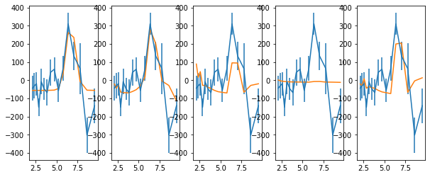


```python
# also fit the refl. frac model on top of a linear trend.
# apply ref. fraction correction

fig, ax = plt.subplots(1,5,figsize=(10,4))
keys = ['spec_hi', 'spec_rel_hi', 'spec_thin_hi', 'spec_therm_hi', 'spec_thin2_hi']
text = 'descriptor en_hi_f2,+- lag_hi_f2_d,+-\n'
text += '\n'.join(['%g %g %g %g'%z for z in zip(en,ene,lag,lage)])
for ik,k in enumerate(keys):
    rf, rq, re, po = rfrac[k]
    rm, rs = np.mean(rf, 0), np.std(rf, 0)
    
    x0 = [0.1, 0.1, 200.0]
    p = opt.minimize(func2, x0, args=(np.log10(en), rm, lag, lage, rs))
    x, xe = p.x, (np.diag(p.hess_inv))**0.5
    print(p, x, xe)
    c2, df = p.fun, len(en)-len(x)
    print('chi2, df, chi2_nu, p: ', c2, df, c2/df, 1-st.chi2.cdf(c2, df=df))
    mod = p.x[0]*np.log10(en) + p.x[1] + rm*p.x[2]
    text += '\ndescriptor lag_hi_f2_m__%s\n'%k
    text += '\n'.join(['%g'%m for m in mod])
    ax[ik].errorbar(en, lag, lage)
    ax[ik].plot(en, mod)
#with open('lag_en_hi_f2__fit.plot', 'w') as fp: fp.write(text)
```

          fun: 18.68713992306901
     hess_inv: array([[  5875.95864724,  -3287.25127262, -27639.54936941],
           [ -3287.25127262,   2012.13053086,  12208.07228858],
           [-27639.54936941,  12208.07228858, 469143.80751731]])
          jac: array([2.86102295e-06, 2.86102295e-06, 0.00000000e+00])
      message: 'Optimization terminated successfully.'
         nfev: 240
          nit: 45
         njev: 48
       status: 0
      success: True
            x: array([-1.01696367e+02,  8.10763563e-01,  5.44045295e+03]) [-1.01696367e+02  8.10763563e-01  5.44045295e+03] [ 76.65480185  44.85677798 684.94073285]
    chi2, df, chi2_nu, p:  18.68713992306901 13 1.4374723017745394 0.1331279433790966
          fun: 18.58696426656816
     hess_inv: array([[  5287.61990798,  -1208.84464398, -14905.57827222],
           [ -1208.84464398,   3639.19692457, -20688.82047699],
           [-14905.57827222, -20688.82047699, 222277.8470982 ]])
          jac: array([ 4.76837158e-07, -4.76837158e-07,  4.76837158e-07])
      message: 'Optimization terminated successfully.'
         nfev: 210
          nit: 35
         njev: 42
       status: 0
      success: True
            x: array([ -35.05694945, -487.04864365, 3747.54823712]) [ -35.05694945 -487.04864365 3747.54823712] [ 72.71602236  60.32575673 471.46351619]
    chi2, df, chi2_nu, p:  18.58696426656816 13 1.4297664820437046 0.13647715647405811
          fun: 36.60134397352611
     hess_inv: array([[  4396.19160687,  -2790.19032778,   6006.86687339],
           [ -2790.19032778,   2170.87798978, -15225.22240758],
           [  6006.86687339, -15225.22240758, 514439.73266771]])
          jac: array([9.53674316e-07, 4.76837158e-07, 0.00000000e+00])
      message: 'Optimization terminated successfully.'
         nfev: 225
          nit: 39
         njev: 45
       status: 0
      success: True
            x: array([ 266.56142281, -255.67684515, 3833.91169221]) [ 266.56142281 -255.67684515 3833.91169221] [ 66.30378275  46.59268172 717.24454175]
    chi2, df, chi2_nu, p:  36.60134397352611 13 2.815487997963547 0.0004782882886579243
          fun: 43.88288853837114
     hess_inv: array([[  8136.82824227,  -7773.96403336,  22879.22311743],
           [ -7773.96403336,   8602.98175195, -30124.77201869],
           [ 22879.22311743, -30124.77201869, 130505.50401918]])
          jac: array([ 3.33786011e-06, -2.38418579e-06, -4.76837158e-07])
      message: 'Optimization terminated successfully.'
         nfev: 210
          nit: 36
         njev: 42
       status: 0
      success: True
            x: array([ 453.83367099, -444.34798744, 1298.32533457]) [ 453.83367099 -444.34798744 1298.32533457] [ 90.20436931  92.75226009 361.25545535]
    chi2, df, chi2_nu, p:  43.88288853837114 13 3.375606810643934 3.209116859548278e-05
          fun: 31.519783653015473
     hess_inv: array([[  4975.77865035,  -2628.47824608, -23657.57331637],
           [ -2628.47824608,   1706.01522825,   1635.21841768],
           [-23657.57331637,   1635.21841768, 786921.80579339]])
          jac: array([2.38418579e-06, 2.14576721e-06, 7.15255737e-07])
      message: 'Optimization terminated successfully.'
         nfev: 225
          nit: 39
         njev: 45
       status: 0
      success: True
            x: array([  54.43670134, -129.21843753, 5476.77811825]) [  54.43670134 -129.21843753 5476.77811825] [ 70.53919939  41.3039372  887.08613212]
    chi2, df, chi2_nu, p:  31.519783653015473 13 2.4245987425396516 0.002828586443557879


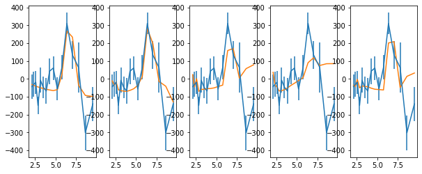


## using the upper limits from the covariance
an upper limit on the ref. fraction means we have a LOWER limit on the lag. Use the 99.7% confidence level


```python
fig, ax = plt.subplots(1,2,figsize=(8,4))
keys = ['cov_hi_f2', 'cov_rel_hi_f2']
for ik,k in enumerate(keys):
    rf, rq, re, po = rfrac[k]
    rm, rs = rq[4], 0
    
    x0 = [0.1, 1000.0 if ik==0 else 10.0]
    p = opt.minimize(func, x0, args=(rm, lag, lage, rs))
    x, xe = p.x, (np.diag(p.hess_inv))**0.5
    print(p, x, xe)
    c2, df = p.fun, len(en)-len(x)
    print('chi2, df, chi2_nu, p: ', c2, df, c2/df, 1-st.chi2.cdf(c2, df=df))
    mod = p.x[0] + rm * p.x[1]
    ax[ik].errorbar(en, lag, lage)
    ax[ik].plot(en, mod)
```

          fun: 19.54912415112572
     hess_inv: array([[  180.90107513,  -832.56599711],
           [ -832.56599711, 21717.66734455]])
          jac: array([ 0.00000000e+00, -2.38418579e-07])
      message: 'Optimization terminated successfully.'
         nfev: 68
          nit: 9
         njev: 17
       status: 0
      success: True
            x: array([ -56.13483855, 1262.31679565]) [ -56.13483855 1262.31679565] [ 13.44994703 147.3691533 ]
    chi2, df, chi2_nu, p:  19.54912415112572 14 1.3963660107946942 0.1450093278270519
          fun: 17.70213093503077
     hess_inv: array([[ 3909.19982344, -8551.66536539],
           [-8551.66536539, 19418.2738137 ]])
          jac: array([4.29153442e-06, 2.14576721e-06])
      message: 'Optimization terminated successfully.'
         nfev: 88
          nit: 15
         njev: 22
       status: 0
      success: True
            x: array([-548.74889371, 1224.87815064]) [-548.74889371 1224.87815064] [ 62.52359413 139.3494665 ]
    chi2, df, chi2_nu, p:  17.70213093503077 14 1.2644379239307693 0.22068584214939846


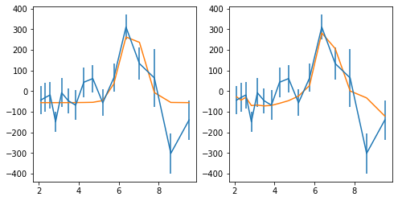


## using the upper limits from the energy spectrum
This is the real upper limit, as the line is not expected to vary by more than the continuum.
an upper limit on the ref. fraction means we have a LOWER limit on the lag


```python
fig, ax = plt.subplots(1,5,figsize=(12,4))
keys = ['spec_hi', 'spec_rel_hi', 'spec_thin_hi', 'spec_therm_hi', 'spec_thin2_hi']

text = 'descriptor en_hi_f2,+- lag_hi_f2_d,+-\n'
text += '\n'.join(['%g %g %g %g'%z for z in zip(en,ene,lag,lage)])
for ik,k in enumerate(keys):
    rf, rq, re, po = rfrac[k]
    rm, rs = rq[4], 0
    
    x0 = [0.1, 1000.0 if ik==0 else 10.0]
    p = opt.minimize(func, x0, args=(rm, lag, lage, rs))
    x, xe = p.x, (np.diag(p.hess_inv))**0.5
    print(p, x, xe)
    c2, df = p.fun, len(en)-len(x)
    txt =('# chi2, df, chi2_nu, p: %g %d %g %g'%(c2, df, c2/df, 1-st.chi2.cdf(c2, df=df))) 
    print(txt)
    mod = p.x[0] + rm * p.x[1]
    text += txt + '\n'
    text += '\ndescriptor lag_hi_f2_m_eSpecLimit__%s\n'%k
    text += '\n'.join(['%g'%m for m in mod])
    ax[ik].errorbar(en, lag, lage)
    ax[ik].plot(en, mod)
with open('lag_en_hi_f2__eSpecLimitFit.plot', 'w') as fp: fp.write(text)
```

          fun: 19.582011526156037
     hess_inv: array([[ 1.78543704e+02, -2.89444719e+03],
           [-2.89444719e+03,  2.42572170e+05]])
          jac: array([1.1920929e-06, 0.0000000e+00])
      message: 'Optimization terminated successfully.'
         nfev: 92
          nit: 14
         njev: 23
       status: 0
      success: True
            x: array([ -59.17223299, 4233.58888739]) [ -59.17223299 4233.58888739] [ 13.36202471 492.51616182]
    # chi2, df, chi2_nu, p: 19.582 14 1.39872 0.14388
          fun: 18.855237853259037
     hess_inv: array([[  3200.43704434, -20518.8006339 ],
           [-20518.8006339 , 137852.76784838]])
          jac: array([7.15255737e-07, 2.38418579e-07])
      message: 'Optimization terminated successfully.'
         nfev: 100
          nit: 18
         njev: 25
       status: 0
      success: True
            x: array([-488.66080012, 3218.63998689]) [-488.66080012 3218.63998689] [ 56.57240533 371.28529172]
    # chi2, df, chi2_nu, p: 18.8552 14 1.3468 0.170555
          fun: 44.557092195961836
     hess_inv: array([[   405.84011634,  -9155.92261036],
           [ -9155.92261036, 324206.42213431]])
          jac: array([9.53674316e-07, 0.00000000e+00])
      message: 'Optimization terminated successfully.'
         nfev: 100
          nit: 17
         njev: 25
       status: 0
      success: True
            x: array([ -86.99915821, 2789.58713283]) [ -86.99915821 2789.58713283] [ 20.14547384 569.39127332]
    # chi2, df, chi2_nu, p: 44.5571 14 3.18265 4.81238e-05
          fun: 55.97967256179675
     hess_inv: array([[ 1153.43419586, -6758.40621841],
           [-6758.40621841, 45325.3821756 ]])
          jac: array([ 3.33786011e-06, -9.53674316e-07])
      message: 'Optimization terminated successfully.'
         nfev: 80
          nit: 12
         njev: 20
       status: 0
      success: True
            x: array([-6.58866514, -7.88733175]) [-6.58866514 -7.88733175] [ 33.96224663 212.89758612]
    # chi2, df, chi2_nu, p: 55.9797 14 3.99855 5.87193e-07
          fun: 32.33200291494134
     hess_inv: array([[ 3.15740138e+02, -8.60958680e+03],
           [-8.60958680e+03,  4.25577051e+05]])
          jac: array([7.15255737e-06, 4.76837158e-07])
      message: 'Optimization terminated successfully.'
         nfev: 100
          nit: 17
         njev: 25
       status: 0
      success: True
            x: array([ -99.49455034, 4497.61406206]) [ -99.49455034 4497.61406206] [ 17.76907814 652.3626684 ]
    # chi2, df, chi2_nu, p: 32.332 14 2.30943 0.00359261


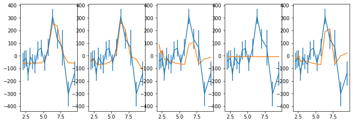


---

### Apply lag correction to the low frequency bin using a log-linear model as a base


```python
# read lag data
os.chdir('%s/%s/cross/16a'%(base_dir, timing_dir))
en, ene = np.loadtxt('cross_en_hi.plot', skiprows=2, max_rows=16).T
ldata =np.loadtxt('cross_en_hi.plot', skiprows=71, max_rows=16)
lag, lage = ldata[:,0], ldata[:,1]
print(lag.shape)
```

    (16,)


```python
fig, ax = plt.subplots(1,5,figsize=(12,4))
keys = ['spec_hi', 'spec_rel_hi', 'spec_thin_hi', 'spec_therm_hi', 'spec_thin2_hi']
for ik,k in enumerate(keys):
    rf, rq, re, po = rfrac[k]
    rm, rs = rq[4], 0
    
    x0 = [0.1, 0.1, 200.0]
    p = opt.minimize(func2, x0, args=(np.log10(en), rm, lag, lage, rs))
    x, xe = p.x, (np.diag(p.hess_inv))**0.5
    print(p, x, xe)
    c2, df = p.fun, len(en)-len(x)
    print('chi2, df, chi2_nu, p: ', c2, df, c2/df, 1-st.chi2.cdf(c2, df=df))
    mod = p.x[0]*np.log10(en) + p.x[1] + rm*p.x[2]
    text += '\ndescriptor lag_hi_f2_m__%s\n'%k
    text += '\n'.join(['%g'%m for m in mod])
    ax[ik].errorbar(en, lag, lage)
    ax[ik].plot(en, mod)
```

          fun: 14.696588518153868
     hess_inv: array([[  47029.50596839,  -27159.28851171, -199288.58719523],
           [ -27159.28851171,   16716.39393919,   95466.22229904],
           [-199288.58719523,   95466.22229904, 2904358.65769701]])
          jac: array([-3.57627869e-07, -3.57627869e-07, -2.38418579e-07])
      message: 'Optimization terminated successfully.'
         nfev: 255
          nit: 41
         njev: 51
       status: 0
      success: True
            x: array([ 1632.03234778, -1057.08504728,  4972.7752967 ]) [ 1632.03234778 -1057.08504728  4972.7752967 ] [ 216.86287365  129.29189433 1704.21790206]
    chi2, df, chi2_nu, p:  14.696588518153868 13 1.1305068090887591 0.3266750815229935
          fun: 12.881381165680757
     hess_inv: array([[  40776.73748131,  -11013.04186291,  -97828.35193325],
           [ -11013.04186291,   28543.52285547, -144687.05520072],
           [ -97828.35193325, -144687.05520072, 1419326.58474568]])
          jac: array([7.15255737e-07, 1.07288361e-06, 3.57627869e-07])
      message: 'Optimization terminated successfully.'
         nfev: 255
          nit: 42
         njev: 51
       status: 0
      success: True
            x: array([ 1680.19290418, -1656.9426703 ,  4250.4869472 ]) [ 1680.19290418 -1656.9426703   4250.4869472 ] [ 201.93250724  168.94828456 1191.35493651]
    chi2, df, chi2_nu, p:  12.881381165680757 13 0.9908754742831352 0.4570153865137203
          fun: 12.301715007217243
     hess_inv: array([[  34770.61614463,  -22710.60993884,   55131.10457744],
           [ -22710.60993884,   16895.87174269,  -89530.31962871],
           [  55131.10457744,  -89530.31962871, 2405487.20583805]])
          jac: array([-4.05311584e-06, -6.91413879e-06,  0.00000000e+00])
      message: 'Optimization terminated successfully.'
         nfev: 270
          nit: 47
         njev: 54
       status: 0
      success: True
            x: array([ 2107.6733558 , -1437.25444724,  5706.64928091]) [ 2107.6733558  -1437.25444724  5706.64928091] [ 186.46880743  129.98412112 1550.96331544]
    chi2, df, chi2_nu, p:  12.301715007217243 13 0.9462857697859418 0.5030720124396935
          fun: 13.269539878548517
     hess_inv: array([[  61511.08262833,  -56123.94144953,  127977.48454996],
           [ -56123.94144953,   58517.43159651, -162771.41907188],
           [ 127977.48454996, -162771.41907188,  593041.17453722]])
          jac: array([4.88758087e-06, 6.19888306e-06, 7.15255737e-07])
      message: 'Optimization terminated successfully.'
         nfev: 235
          nit: 37
         njev: 47
       status: 0
      success: True
            x: array([ 2547.4047961 , -1949.17957135,  2639.67510041]) [ 2547.4047961  -1949.17957135  2639.67510041] [248.01427908 241.90376516 770.09166632]
    chi2, df, chi2_nu, p:  13.269539878548517 13 1.0207338368114245 0.4272139186449848
          fun: 12.401844293338026
     hess_inv: array([[  36800.56291821,  -20932.77415973, -106872.20716475],
           [ -20932.77415973,   13715.34160275,    5749.74079883],
           [-106872.20716475,    5749.74079883, 3531427.16445363]])
          jac: array([ 2.38418579e-07, -1.19209290e-07,  3.57627869e-07])
      message: 'Optimization terminated successfully.'
         nfev: 260
          nit: 43
         njev: 52
       status: 0
      success: True
            x: array([ 1759.98738876, -1209.30530024,  7038.72026607]) [ 1759.98738876 -1209.30530024  7038.72026607] [ 191.83472813  117.11251685 1879.20918592]
    chi2, df, chi2_nu, p:  12.401844293338026 13 0.9539880225644636 0.4949996943301558


```python

```


```python

```


```python

```


```python
# Get residual energies scan #
bsuff = '16lch'
os.chdir('%s/%s/cross/%s'%(base_dir, timing_dir, bsuff))
tcl = 'para st 40\n'
for suff in ['f1', 'f2', 'hi_f1', 'hi_f2', 'lo_f1', 'lo_f2']:
    tcl += 'source %s/fit.tcl\ncov_scan %s_m1\n#cov_scan_sim %s_m1\n'%(base_dir, suff, suff)
with open('tmp.xcm', 'w') as fp: fp.write(tcl)
cmd = 'xspec - tmp.xcm > tmp.log 2>&1'
p = subp.call(['/bin/bash', '-i', '-c', cmd])
```


```python
# Get residual energies with mcmc
ib, bsuff = 24, 'lch'
os.chdir('%s/%s/cross/%d%s'%(base_dir, timing_dir, ib, bsuff))
tcl = 'para walk 40\nquery no\nset txt ""\ncpd /cps\n'
tcl += 'chain len 1000000; chain burn 1000000; chain walk 200\n'
for suff in ['f2', 'hi_f1', 'hi_f2', 'lo_f2']:
    tcl += '@fits/cov_add_%s_m1\nfit\n'%suff
    tcl += 'add 1 zga & 2 .1 2 2 10 10& 0 -1 & 0.00618& 1e-5 .1 -1 -1 1 1\nfit\n'
    tcl += 'chain unload 1\n'
    #tcl += 'rm fits/cov_add_%s.fits\nchain run fits/cov_add_%s.fits\n'%(suff, suff)
    tcl += 'chain load fits/cov_add_%s.fits\n'%suff
    tcl += 'marg 1 2 10 300\n'
    tcl += 'set x [tcloutr plot marg x 1]\nset y [tcloutr plot marg y 1]\n'
    tcl += 'append txt "\\ndescriptor en_%s prob_%s\\n"\n'%(suff, suff)
    tcl += 'for {set i 0} {$i<[llength $x]} {incr i} {\n'
    tcl += '\tappend txt "[lindex $x $i] [lindex $y $i]\\n"\n}\n'
tcl += 'set fp [open plots/fit_cov_mcmc.plot w]\nputs $fp $txt\nclose $fp'
#print(tcl)   
with open('tmp.xcm', 'w') as fp: fp.write(tcl)
cmd = 'xspec - tmp.xcm > tmp.log 2>&1'
p = subp.call(['/bin/bash', '-i', '-c', cmd])
```

## Test more frequency bins
- More appropriate for the low flux lag-vs-frequency above.
- called {lcdir}F2 after running the code; the main one above is {lcdir}


```python
fqbin  = {'bins': [1e-4, 1.8e-4, 2.6e-4]}
NFQ = 2
```


```python

bsuff = 'a'
for ib in [8, 16]:
    wdir = '%s/%s/cross/%d%sF2'%(base_dir, timing_dir, ib, bsuff)
    os.system('mkdir -p %s'%wdir); os.chdir(wdir)
    ebins = ' '.join(['%g'%x for x in np.logspace(np.log10(2),1,ib+1)])
    lcdir, ebins, dt = '%d%s'%(ib, bsuff), ebins, 128
    crss = calc_cross_prodcuts(lc_obsids, lcdir, dt, ebins, [seglen, min_len], fqbin=fqbin)
    
    os.system('cp %s/%s/../xmm_spec/spec_add_%s.???.b .'%(base_dir, timing_dir, lcdir))
    
    #specfile = glob.glob('spec_add_%s.grp.b'%lcdir)[0]
    write_cross_prodcuts(crss, specfile=None, nfq=NFQ, 
                out_dir='%s/%s/cross/%sF2'%(base_dir, timing_dir, lcdir), suff='F2')
```

    segment lengths (ks):  21.1 | 20.0 | 19.3 | 20.0 | 87.7 | 90.4 | 122.1
    energy bin indices:  [0, 1, 2, 3, 4, 5, 6, 7]
    number of frequencies:  [30 32]
    saved products vs freq to cross_enF2.plot
    segment lengths (ks):  21.1 | 20.0 | 19.3 | 20.0 | 87.7 | 90.4 | 122.1
    energy bin indices:  [0, 1, 2, 3, 4, 5, 6, 7, 8, 9, 10, 11, 12, 13, 14, 15]
    number of frequencies:  [30 32]
    saved products vs freq to cross_enF2.plot


```python
fig, ax = plt.subplots(2,NFQ,figsize=(12,6))
for ilab,lab in enumerate(labels[:2]):
    print('--- ', lab, ' ---')
    for ib in [8, 16]:
        wdir = '%s/%s/cross/%d%sF2'%(base_dir, timing_dir, ib, bsuff)
        os.system('mkdir -p %s'%wdir); os.chdir(wdir)
        lcdir, ebins, dt = '%da'%ib, ' '.join(['%g'%x for x in np.logspace(np.log10(2),1,ib+1)]), 128
        crss = calc_cross_prodcuts([lc_obsids[i] for i in indv[ilab]], lcdir, dt, ebins, 
                                   [seglen, min_len], fqbin=fqbin, overlap=None)

        # plot & write #
        en, lag = crss['en'][0], crss['lag']
        for ii in range(NFQ):
            ax[ilab, ii].errorbar(en, lag[:, 0, ii], lag[:, 1, ii], fmt='o', color='C0')
            ax[ilab, ii].set_ylim([-800, 1000])
        plt.tight_layout()
        write_cross_prodcuts(crss, nfq=NFQ, suff='F2_%s'%lab,
                            out_dir='%s/%s/cross/%sF2'%(base_dir, timing_dir, lcdir))    
```

    ---  lo  ---
    segment lengths (ks):  21.1 | 20.0 | 19.3 | 122.1
    energy bin indices:  [0, 1, 2, 3, 4, 5, 6, 7]
    number of frequencies:  [14 16]
    saved products vs freq to cross_enF2_lo.plot
    segment lengths (ks):  21.1 | 20.0 | 19.3 | 122.1
    energy bin indices:  [0, 1, 2, 3, 4, 5, 6, 7, 8, 9, 10, 11, 12, 13, 14, 15]
    number of frequencies:  [14 16]
    saved products vs freq to cross_enF2_lo.plot
    ---  hi  ---
    segment lengths (ks):  20.0 | 87.7 | 90.4
    energy bin indices:  [0, 1, 2, 3, 4, 5, 6, 7]
    number of frequencies:  [16 16]
    saved products vs freq to cross_enF2_hi.plot
    segment lengths (ks):  20.0 | 87.7 | 90.4
    energy bin indices:  [0, 1, 2, 3, 4, 5, 6, 7, 8, 9, 10, 11, 12, 13, 14, 15]
    number of frequencies:  [16 16]
    saved products vs freq to cross_enF2_hi.plot


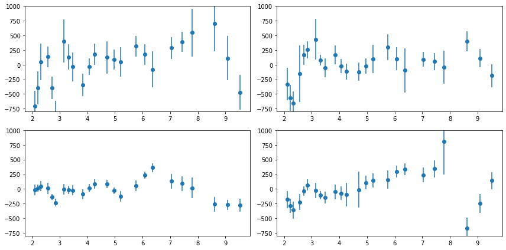


```python
pwd
```


    '/home/Reverb1/abzoghbi/data/ngc5506/spec_timing_paper/data/xmm_timing/cross/16aF2'


```python

```
